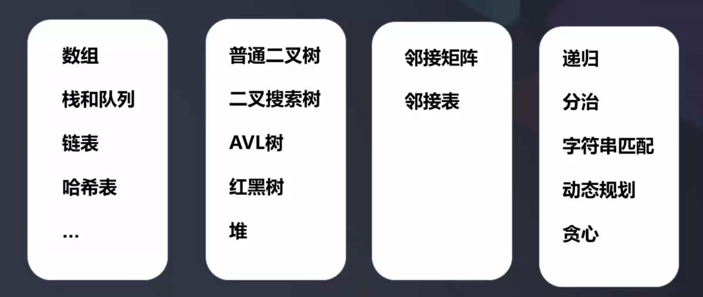

# 开始

DaLiu Start...  

  

**数据结构 (data structure)**  
- 是相互之间存在一种或多种特定关系的数据元素的集合
- 研究的是数据的逻辑结构或物理结构
- 包括线性结构和非线性结构

**算法(Algorithm)**  
- 是解题方案的准确而完整的描述, 是一系列解决问题的清晰指令 
- 代表着用系统的方法描述解决问题的策略机制
- 一个算法的优劣可以用时间复杂度和空间复杂度来衡量

### 学习算法环境设置

[数据结构脑图](https://naotu.baidu.com/file/0a53d3a5343bd86375f348b2831d3610?token=5ab1de1c90d5f3ec)  
[算法脑图](https://naotu.baidu.com/file/0a53d3a5343bd86375f348b2831d3610?token=5ab1de1c90d5f3ec)  

[力扣](https://leetcode-cn.com/)

- 一维(线性数据结构)
    - 基础: 数组array (string), 链表 linked list
    - 高级: 栈stack, 队列 queue, 双端队列 dequeue, 集合set, 映射map(hash or map), etc
- 二维
    - 基础: 树tree, 图graph
    - 二叉搜索树 binary search tree, 红黑树(red-black tree, AVL), 堆heap, 并查集disjoint set, 字典树 Trie, etc
- 特殊
    - 位运算Bitwise, 布隆过滤器BloomFilter 
    - LRU Cache

------------------------------------------------------------------------

### 算法 
- If-else, switch ----> branch
- for, while loop ----> Iteration
- 递归Recursion (Divide & Conquer, Backtrace)  
- 搜索Search: 深度优先搜索Depth first aearch, 广度优先搜索Breadth first search, A*, etc
- 动态规划 Dynamic Programming
- 二分查找 Binary Search
- 贪心Greedy
- 数据Math, 几何Geometry

------------------------------------------------------------------------

### 切题

- Clarification
- Possible solutions
- Compare(time/space)
- optimal (加强)
- Coding
- Test cases  

------------------------------------------------------------------------

### MAC配置

[iterm2 + zsh + oh-my-zsh](https://www.jianshu.com/p/c5c5037f72e0)

------------------------------------------------------------------------

### IDE推荐
VSCode; Java: IntelliJ; Python: Pycharm
插件: LeetCode pluin (VSCode & IntelliJ)

[中文LeetCode](https://leetcode-cn.com/)

------------------------------------------------------------------------

### 一些常见数据结构的优缺点分析

| 数据结构      |      优点       |  缺点 |
| :----------  | :---------- | :----------  |
| 数组      | 查找快，若知道下标，可以非常快的存取 | 查找慢，删除慢，大小固定 |
| 有序数组  | 比无序数组查找快 | 删除和插入慢， 大小固定 |
| 栈 | 提供后进先出的方式存取 （LIFO） | 存取其他项很慢 |
| 队列 | 提供先进先出方式存取 （FIFO） | 存取其他项很慢 |
| 链表 | 插入和删除快 (宜在表头尾操作) | 查找慢 |
| 二叉树 | 插入、查找、删除都快（如果树保持平衡） | 删除算法复杂 |
| 红黑树 | 插入、查找、删除都快, 树总是平衡的 | 算法复杂 |
| 2-3-4 树 | 插入、查找、删除都快。树总是平衡的。类似的树对磁盘存储有用 | 算法复杂 |
| 哈希表 | 如果关键字已知则存取极快。插入快 | 删除慢、如果不知道关键字则存取很慢，对存储空间使用不充分 |
| 堆 | 插入、删除快，对最大数据项的存取很快 | 对其他存取项很慢 |
| 哈希表 | 如果关键字已知则存取极快。插入快 | 删除慢、如果不知道关键字则存取很慢，对存储空间使用不充分 |
| 图 | 对现实世界建模 | 删除慢、如果不知道关键字则存取很慢，对存储空间使用不充分 |
| 哈希表 | 如果关键字已知则存取极快。插入快 | 有些算法慢且复杂 |

