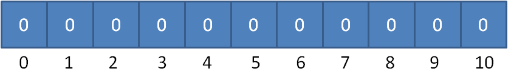

# 计数排序

[这里](http://www.sohu.com/a/258222713_684445)有计数排序的原理说明。

计数排序的特点是元素之间不相互比较，而是把元素的值和索引关联起来。缺点是要求需要排序的有一定的范围。
比如有一堆需要排序的数，范围 0到10，即这一堆数是在[0,1,2,3,4,5,6,7,8,9,10]这11个数里面。
我们可以建立一个长度为11的数组，数组下标从0到10，元素全初始化为0：



假定20个随机整数的值如下：

**9，3，5，4，9，1，2，7，8，1，3，6，5，3，4，0，10，9 ，7，9**

遍历这个无序的随机数列，每一个整数按照其值对号入座，对应数组下标的元素进行加1操作。

比如第一个整数是9，那么数组下标为9的元素加1：


继续遍历数列并修改数组......
最终，数列遍历完毕时，数组的状态如下：


有了这个“统计结果”，排序就很简单了。直接遍历数组，输出数组元素的下标值，元素的值是几，就输出几次：

**0，1，1，2，3，3，3，4，4，5，5，6，7，7，8，9，9，9，9，10**

显然，这个输出的数列已经是有序的了。

代码实现示例：

**java**

```java
import java.util.Arrays;

public class CountSort {
	public static int[] countSort(int[] array) {
		// 找到数组中最大的元素
		int max = array[0];
		for (int i = 1; i < array.length; i++) {
			if (array[i] > max) {
				max = array[i];
			}
		}
		
		int[] countArray = new int[max+1];
		// 遍历数组，填充统计数组, 对应的元素到对应的索引处
		for (int i = 0; i < array.length; i++) {
			countArray[array[i]]++;
		}
		// 遍历统计数组，输出结果
		int index = 0;
		int[] sortedArray = new int[array.length];
		for (int i = 0; i < countArray.length; i++) {
			for (int j = 0; j < countArray[i]; j++) {
				sortedArray[index++] = i;
			}
		}
		return sortedArray;
	}
	
	public static void main(String[] args) {
		int[] array = new int[] {4,4,6,5,3,2,8,1,7,5,6,0,10};
		int[] sortedArray = countSort(array);
		System.out.println(Arrays.toString(sortedArray)); // [0, 1, 2, 3, 4, 4, 5, 5, 6, 6, 7, 8, 10]
	}
}
```

上面的代码中，当遍历数组，填充统计数组, 对应的元素到对应的索引处。为了取countArray对应的数，先遍历countArray, 然后从0开始遍历countArray中每个元素的值：

```java
int[] sortedArray = new int[array.length];
for (int i = 0; i < countArray.length; i++) {
	for (int j = 0; j < countArray[i]; j++) {
		sortedArray[index++] = i;
	}
}
```

这一步双层循环可以优化。

比如：


值为0的有1个，值为1的有2个，值为2的有1个，值为3的有3个.. 在这个数组中它本身是有序的。对于索引为3的数，如果把前面所有的值相加，即：1+2+1 = 4, 即索引为3的数前面共有4位。同样，任何一位数，它前面所有的数相加就代表了它前面有几个数，基于此，可以优化上面的代码：

```java
import java.util.Arrays;

public class CountSort {
	public static int[] countSort(int[] array) {
		// 找到数组中最大的元素
		int max = array[0];
		for (int i = 1; i < array.length; i++) {
			if (array[i] > max) {
				max = array[i];
			}
		}
		
		int[] countArray = new int[max+1];
		// 遍历数组，填充统计数组, 对应的元素到对应的索引处
		for (int i = 0; i < array.length; i++) {
			countArray[array[i]]++;
		}
		for (int i = 1; i < countArray.length; i++) {
			countArray[i] += countArray[i-1];
		}
	
		// 遍历统计数组，输出结果
		int[] sortedArray = new int[array.length];
		for (int i = 0; i < array.length; i++) {
			sortedArray[countArray[array[i]] - 1] = array[i];
			countArray[array[i]] -= 1;
		}
		return sortedArray;
	}
	
	public static void main(String[] args) {
		int[] array = new int[] {4,4,6,5,3,2,8,1,7,5,6,0,10};
		int[] sortedArray = countSort(array);
		System.out.println(Arrays.toString(sortedArray)); // [0, 1, 2, 3, 4, 4, 5, 5, 6, 6, 7, 8, 10]
	}
}
```

不过，使用计数排序算法如果是拿来排序数字，最好还是有范围标识，否则假如两个数：80，90，开辟90个空间，浪费很多，我们可以稍微优化一点，对于80, 90，求出最大值和最小值，只开辟11个空间，而不是开辟90个空间。

**java**示例：

```java
import java.util.Arrays;

public class CountSort2 {
	public static int[] countSort(int[] array) {
		// 得到数列的最大值和最小值，并算出差值d
		int max = array[0];
		int min = array[0];
		for (int i = 1; i < array.length; i++) {
			if (array[i] > max) {
				max = array[i];
			}
			if (array[i] < min) {
				min = array[i];
			}
		}
		int d = max - min;
		// 创建统计数组并统计对应元素个数
		int[] countArray = new int[d+1];
		for (int i = 0; i < array.length; i++) {
			countArray[array[i] - min]++; // 当前值-min即对应索引
		}
		// 统计数组做变形，后面的元素等于前面的元素之和
		for (int i = 1; i < countArray.length; i++) {
			countArray[i] += countArray[i-1];
		}
		// 从统计数组找到正确位置，输出到结果数组
		int[] sortedArray = new int[array.length];
		for (int i = 0; i < array.length; i++) {
			sortedArray[countArray[array[i]-min]-1] = array[i];
			countArray[array[i]-min]--;
		}
		return sortedArray;
	}
	
	public static void main(String[] args) {
		int[] array = new int[] {95,94,91,98,99,90,99,93,91,92};
		int[] sortedArray = countSort(array);
		System.out.println(Arrays.toString(sortedArray));
	}
}
```

不过，用计数排序来排序数字的情况可能并不太好，不仅对于小数这种东西无法排序，而且如果数字范围很大，就可能开辟很大空间，比如3个数字：1, 2, 10000000000, 那么用计数排序的时间复杂度就很大，所以很多情况计数排序用来排序ASCII字符，字符就在256以内，这样也不用计算出最大值和最小值，示例：

**c++**示例：

```Cpp
// CountSort.cpp
// C++ Program for counting sort  
#include<stdio.h>
#include <iostream>
#include<string.h> 
using namespace std;  
#define RANGE 255  
  
// The main function that sort  
// the given string arr[] in  
// alphabatical order  
void countSort(char arr[])  
{  
    // The output character array  
    // that will have sorted arr  
    char output[strlen(arr)];  
  
    // Create a count array to store count of inidividul  
    // characters and initialize count array as 0  
    int count[RANGE + 1], i;  
    memset(count, 0, sizeof(count));  
  
    // Store count of each character  
    for(i = 0; arr[i]; ++i) 
        ++count[arr[i]];  
  
    // Change count[i] so that count[i] now contains actual  
    // position of this character in output array  
    for (i = 1; i <= RANGE; ++i)  
        count[i] += count[i-1];  
  
    // Build the output character array  
    for (i = 0; arr[i]; ++i)  
    {  
        output[count[arr[i]]-1] = arr[i];  
        --count[arr[i]];  
    }  
  
    /*  
    For Stable algorithm  
    for (i = sizeof(arr)-1; i>=0; --i)  
    {  
        output[count[arr[i]]-1] = arr[i];  
        --count[arr[i]];  
    }  
      
    For Logic : See implementation  
    */
  
    // Copy the output array to arr, so that arr now  
    // contains sorted characters  
    for (i = 0; arr[i]; ++i)  
        arr[i] = output[i];  
}  
  
// Driver  code 
int main()  
{  
    char arr[] = "geeksforgeeks"; 
  
    countSort(arr);  
  
    cout<< "Sorted character array is " << arr;  
    return 0;  
}  
  
// This code is contributed by rathbhupendra
```

```
g++ CountSort.cpp
./a.out
```

**python**示例：

```python
def countSort(arr): 
  
    output = [0 for i in range(256)] 
  
    count = [0 for i in range(256)] 
  
    ans = ["" for _ in arr] 
  
    for i in arr: 
        count[ord(i)] += 1
  
    for i in range(256): 
        count[i] += count[i-1] 
  
    for i in range(len(arr)): 
        output[count[ord(arr[i])]-1] = arr[i] 
        count[ord(arr[i])] -= 1
  
    for i in range(len(arr)): 
        ans[i] = output[i] 
    return ans  
  
arr = "wwwrunoobcom"
ans = countSort(arr) 
print ( "字符数组排序 %s"  %("".join(ans)) )
```


