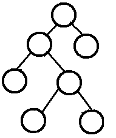

# 二叉树

**树的基本术语**

参考
[https://www.cnblogs.com/idorax/p/6441043.html](https://www.cnblogs.com/idorax/p/6441043.html)
[http://alrightchiu.github.io/SecondRound/binary-tree-introjian-jie.html](http://alrightchiu.github.io/SecondRound/binary-tree-introjian-jie.html)
[http://alrightchiu.github.io/SecondRound/binary-tree-jian-li-yi-ke-binary-tree.html](http://alrightchiu.github.io/SecondRound/binary-tree-jian-li-yi-ke-binary-tree.html)
[https://github.com/alrightchiu/SecondRound](https://github.com/alrightchiu/SecondRound)

- Root: 根结点
- Child: 子
- Parent: 父
- Siblings: 兄弟
- Ancestor: 祖先 结点的祖先(Ancestor)是从根（Root）到该结点所经分支(Branch)上的所有结点。
- Descendant: 子孙 以某结点为根的子树中的任一结点都称为该结点的子孙(后代)
- Leaf: 叶子 没有孩子的结点(也就是度为0的结点)称为叶子(Leaf)或终端结点。
- Branch: A node with at least one child. 分支(非叶子结点一律可称为Branch, 分支)
- Degree: 度 结点所拥有的子树个数称为结点的度(Degree)
- Edge: 边, 一个结点和另一个结点之间的连接被称之为边(Edge)
- Path: 路径 连接结点和其后代的结点之间的(结点,边)的序列
- Level: 层次, 结点的层次(Level)从根(Root)开始定义起，根为第0层，根的孩子为第1层。以此类推，若某结点在第i层，那么其子树的根就在第i+1层
- HeightOfNode: 结点的高度 该结点和某个叶子之间存在的最长路径上的边的个数
- HeightOfTree: 树的高度, 即根结点的高度
- DeptOfNode: 结点的深度. 是从树的根结点到该结点的边的个数
- Forest: 森林, 森林是n(>=0)棵互不相交的树的集合

**二叉树**

Binary Tree,  每个结点至多拥有两棵子树(即二叉树中不存在度大于2的结点)

**二叉树的性质**

1. 若二叉树的层次从0开始，则在二叉树的第i层至多有2^i个结点(i>=0)
2. 高度为k的二叉树最多有2^(k+1) - 1个结点(k>=-1)。 (空树的高度为-1)
3. 对任何一棵二叉树，如果其叶子结点(度为0)数为m, 度为2的结点数为n, 则m = n + 1

**PBT: Perfect Binary Tree**

> A Perfect Binary Tree(PBT) is a tree with all leaf nodes at the same depth. 
> All internal nodes have degree 2. 

Perfect Binary Tree被称为完美二叉树或完满二叉树.

Perfect Binary Tree满足两个条件:

- 所有的叶子结点深度相同(结点的深度 是从树的根结点到该结点的边的个数)
- 除叶子结点外, 所有结点的度为2(结点所拥有的子树个数称为结点的度(Degree))

一个深度为k(>=-**1**)且有2^(k+1) - 1个结点的二叉树称为**完美二叉树**

**Complete Binary Tree**

Complete Binary Tree完全二叉树:

> A Complete Binary Tree （CBT) is a binary tree in which every level, 
except possibly the last, is completely filled, and all nodes 
are as far left as possible.

完全二叉树从根结点到倒数第二层满足完美二叉树，最后一层可以不完全填充，其叶子结点都靠左对齐。

**Full  Binary Tree**

Full Binary Tree 完满二叉树
> A Full Binary Tree (FBT) is a tree in which every node other than the leaves has two children.

即所有所有非叶子结点的度都是2。（只要你有孩子，你就必然是有两个孩子), Full Binary Tree又叫做Strictly Binary Tree.

**Full and Complete Binary Tree区分**

**完满(Full)二叉树 v.s. 完全(Complete)二叉树 v.s. 完美(Perfect)二叉树**

