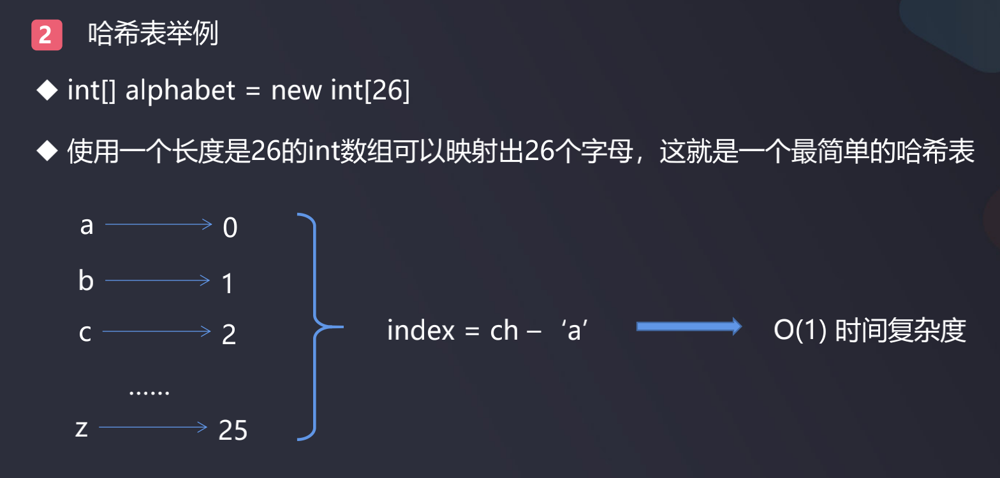

# 哈希表

- 哈希表（Hash table），是根据关键码值(Key value)而直接进行访问的数据结构
- 它通过把关键码（key）值映射到表中一个位置来访问记录，以加快查找的速度
- 这个映射函数叫做散列函数，存放记录的数组叫做散列表; 散列函数也称做哈希函数
- 给定表M，存在函数f(key)，对任意给定的关键字值key
  - 代入函数后若能得到包含该关键字的记录在表中的地址，则称表M为哈希(Hash)表, 或散列表
  - 函数f(key)为哈希(Hash)函数, 也叫散列函数
- 由于通过Key和这种函数关系可以导出值, 因此哈希表是一个"下标具有语义的数组", 这里的语义就是哈希函数

哈希表示例:



看一个Leetcode上利用哈希表思想的算法题: [示例](https://leetcode-cn.com/problems/first-unique-character-in-a-string/)  

给定一个字符串，找到它的第一个不重复的字符，并返回它的索引。如果不存在，则返回 -1  
示例:

```
s = "leetcode"
返回 0, 'l'是第一个不重复的字符

s = "lovelee
返回 2, 'v'是第一个不重复的字符
```

```java
public class Solution {
    public int firstUniqChar(String s) {
        int[] uniqCharArray = new int[26];
        /**
         * 索引: 0 1 2 3 4 5 6 7 8 9 ... 25
         * 字符: a b c d e f g h i j ... z
         * 映射关系, 即哈希函数: 字符数值 - 'a' = 索引值
         */
        for (int i = 0; i < s.length(); i++) {
            uniqCharArray[s.charAt(i)-'a']++; // 初始化uniqCharArray: [0 1 2 3 4 5 6 7 8 9 ... 25]
        }
        for (int i = 0; i < s.length(); i++) {
            if (uniqCharArray[s.charAt(i) - 'a'] == 1) {
                return i;
            }
        }
        return -1;
    }

    // 测试
    public static void main(String[] args) {
        Solution solution = new Solution();
        System.out.println(solution.firstUniqChar("leetcode")); // 0
        System.out.println(solution.firstUniqChar("loveleetcode")); // 2
    }
}

```

