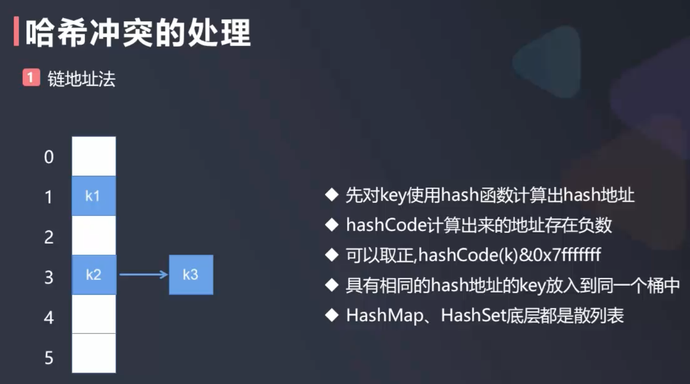

# 剖析HashMap

为了理解HashMap, 此次我们先自定义一个最简单的哈希表(只是为了说明哈希表的hash方法)

  

### 自定义HashMap(仅简单说明hashCode方法)

```java
package com.daliu.hash;

import java.util.TreeMap;

public class HashTable<K, V> {
    private TreeMap<K, V>[] hashtable;
    private int size; // 实际存放了多少个元素
    private int M; // 数组总容量

    public HashTable(int M) {
        this.M = M;
        size = 0;
        hashtable = new TreeMap[M];
        for (int i = 0; i < M; i++) {
            hashtable[i] = new TreeMap<>();
        }
    }

    public HashTable() {
        this(16);
    }

    public int getSize() {
        return size;
    }

    // hash方法: 根据key的值获取对应数组下标的值
    public int hash(K key) {
        return key.hashCode() & 0x7fffffff % M;
    }

    // 添加操作
    // key已经存在就是修改操作
    // key不存在就是添加操作
    public void add(K key, V value) {
        int index = hash(key);
        TreeMap<K, V> treeMap = hashtable[index];
        if (treeMap.containsKey(key)) {
            treeMap.put(key, value);
        } else {
            treeMap.put(key, value);
            size++;
        }
    }

    public V remove(K key) {
        int index = hash(key);
        TreeMap<K, V> treeMap = hashtable[index];
        if (treeMap.containsKey(key)) {
            V ret = treeMap.remove(key);
            size--;
            return ret;
        }
        return null; // 没有删除成功
    }

    public V get(K key) {
        return hashtable[hash(key)].get(key);
    }

    public boolean contains(K key) {
        return hashtable[hash(key)].containsKey(key);
    }
}
```

### HashMap底层put过程

- HashMap的底层是哈希表
- 哈希表是由数组+链表组成的
- JDK1.8以后, HashMap的哈希表是由数组+链表+红黑树组成的
- 数组中每一个元素被称为bucket(桶), 桶中放的是Node, 即节点, 每一个Node存储的值是Key, Value的形式

1. 初始化数组并给于一定的容量
2. 当进行put操作时, 根据Key计算出桶的下标, 放入桶中
3. 当不断的进行put操作时, 数组满了就需要扩容
4. java在做扩容时的机制使用提前量, 即设定了一个扩容因子0.75, 当put操作时达到了数组总长度*0.75个时就会扩容为原来数组的2倍
5. 如果在进行put操作时发现原来桶的位置已经有元素了, 则:
  - 如果key相同, 则替换; 如果key不相同, 就是出现了Hash冲突, 则使用链地址法解决冲突, 这些有冲突的节点通过链表的形式放在同一个桶内
  - 当桶中的Node数到达8时, 即链表的节点数到达8时, 则java则把这个链表转换为2叉树的一种: 红黑树, 这叫做树化; 
  - 当把桶中的Node删除操作减少到6时, 红黑树就转为普通的链表, 这叫做链化
6. 出现哈希冲突时, jdk1.7时是链头插入, jdk1.8时是链尾插入
7. 如何根据key得到桶
  - 根据key计算出hash值: int hashcode = key.hashCode()
  - 假设数组长度为16, 则:  
    - 为了让hash值落到0~15之间, 需要: hashCode%16
    - java中使用hash(key)完成: key.hashCode()&(n-1), 这里的n是数组总长度
    - 注: java中hash(key)为了尽可能离散, 使用高16位异或低16位, int hash = hash(key) = (key.hashCode()^低16位) & (n-1)

根据key得到桶的示例:

```
hash(key) 位运算完成, 比如: int hashCode = 01010101010101111, 为了使之分布在0~15之间, 需要:
  01010101010101111
&             01111  // 15
---------------------------
  0000000000000111   // 落在了数组中索引为7的位置
```

```java
static final int hash(Object key) {
     int h;
     return (key == null) ? 0 : (h = key.hashCode()) ^ (h >>> 16);
}
```

[这一个贴子](https://blog.csdn.net/hefenglian/article/details/79763634)对JDK1.7和1.8的HashMap的说明比较详细