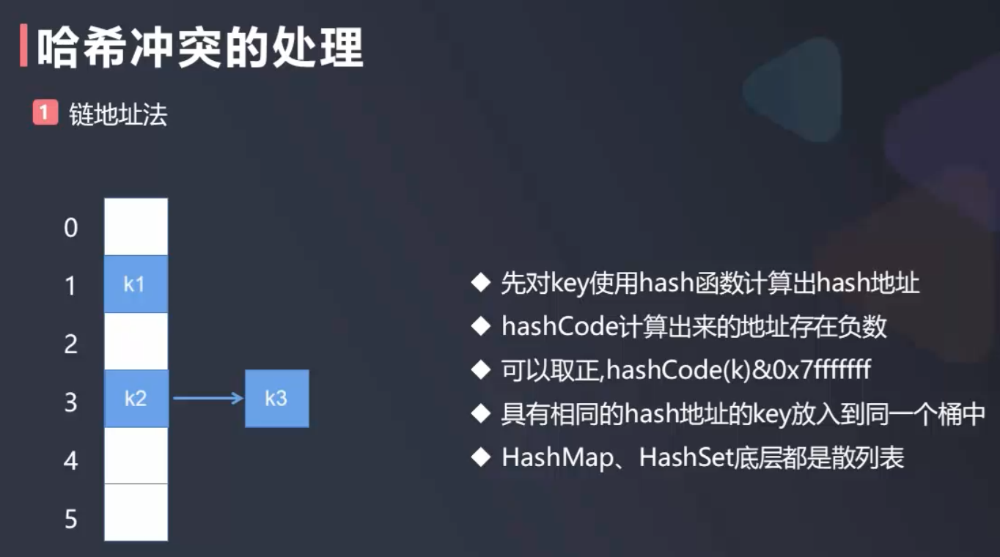

# 哈希冲突

### 链地址法
Java中HashSet, HashMap等数据结构底层都是哈希表, 其内部解决哈希冲突的方法是链地址法  

比如:  

下面的哈希表(底层是数组)对应的下标分别是0,1,2,3,4,5, 添加元素k1时计算出k1的哈希int值和哈希表中的位置索引1对应, 再添加元素k2时计算出k2的哈希值对应的位置索引为2, 这时候又有一个元素k3, 但添加元素k3时计算出k3对应的哈希表中的位置索引也是2, 此时就产生了哈希冲突   
可以采用链地址法解决这一冲突, 将k3链接到k2的后面  

 

[参考](https://blog.csdn.net/qq_42914528/article/details/108067583), HashMap的一部分相关源码:
```java
public V put(K key, V value) {  
        if (key == null)  
            return putForNullKey(value);  
        int hash = hash(key.hashCode());  
        int i = indexFor(hash, table.length);  
        for (Entry<K,V> e = table[i]; e != null; e = e.next) {  
            Object k;  
            //判断当前确定的索引位置是否存在相同hashcode和相同key的元素，如果存在相同的hashcode和相同的key的元素，那么新值覆盖原来的旧值，并返回旧值。  
            //如果存在相同的hashcode，那么他们确定的索引位置就相同，这时判断他们的key是否相同，如果不相同，这时就是产生了hash冲突。  
            //Hash冲突后，那么HashMap的单个bucket里存储的不是一个 Entry，而是一个 Entry 链。  
            //系统只能必须按顺序遍历每个 Entry，直到找到想搜索的 Entry 为止——如果恰好要搜索的 Entry 位于该 Entry 链的最末端（该 Entry 是最早放入该 bucket 中），  
            //那系统必须循环到最后才能找到该元素。  
            if (e.hash == hash && ((k = e.key) == key || key.equals(k))) {  
                V oldValue = e.value;  
                e.value = value;  
                return oldValue;  
            }  
        }  
        modCount++;  
        addEntry(hash, key, value, i);  
        return null;  
    }  
    ...
}
```

注: jdk1.8引入了红黑树来处理因大量hash冲突而引起的效率问题

### 开放地址法

除了链地址法解决Hash冲突外, 还有一种常见的解决Hash冲突的方法: 开放地址法


如上图所示:  
- 按照hash函数hash(k)=key%10的映射原则计算出:
- 11得到的位置索引为1, 于是11放到了索引为1的位置
- 21对应的位置也是1, 但发现位置为1的地方已被占领, 于是从索引为1的位置的后面寻找第一个没有被占的位置, 即2, 于是21放在了2号位置
- 同理31放在了3号位置


这种方式就叫做开放地址法, 使用开放地址法解决哈希冲突时很可能出现冲突雪崩的情况, 因为由于每个元素都有一个自己相应的位置, 后面的元素根据哈希函数算出来的索引位置可能已被占领, 导致一连串的元素根据hash函数算出来的索引位置往后面顺移  

- 开放地址法也叫线性控测法

由于线性探测法有这个明显的缺点, 因此也相应出现了一些优化的方法, 比如:
- 平方探测
- 再哈希法
- 合理扩容