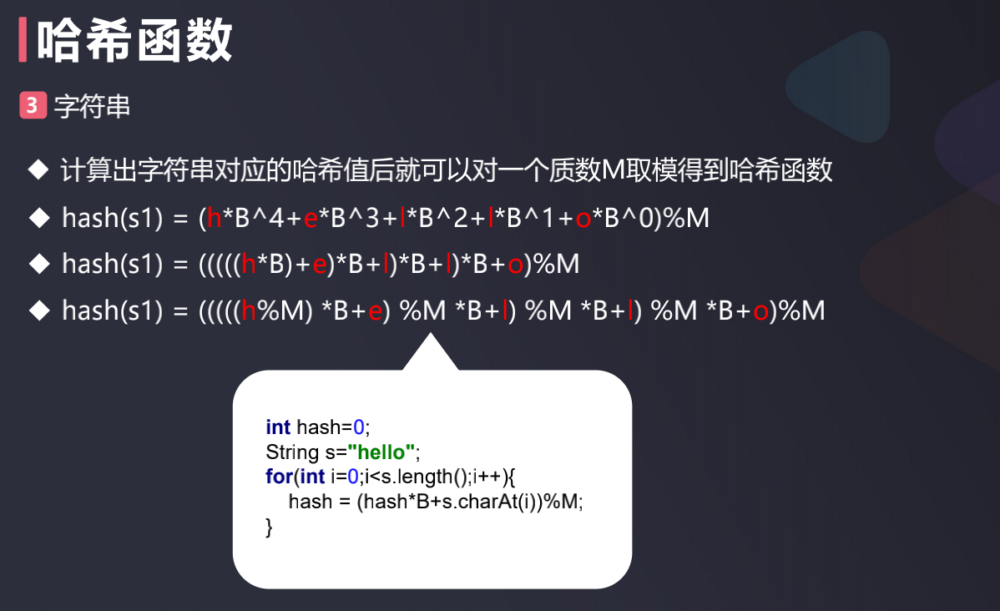

# 哈希函数设计原则

哈希表和哈希函数  

- 将键转换成索引的函数就是哈希函数 f(ch)= ch –‘a’
- 将业务场景中的键转换为索引的过程是哈希表的核心
- 即使再优秀的哈希函数也保证不了一个键对应一个不同的索引，这就是哈希冲突
- 设计哈希函数的原则
  - 一致性：如果a==b，那么hash(a)==hash(b)
  - 高效性: 哈希函数的计算要简单高效
  - 均匀性：尽可能地让哈希值均匀分布, 减少哈希冲突
- 哈希表体现了算法设计领域中空间换时间的思想

### 哈希函数常见设计规则示例

