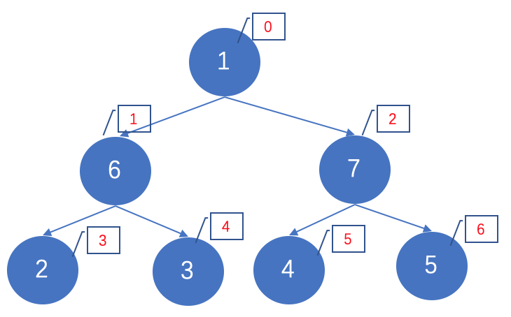
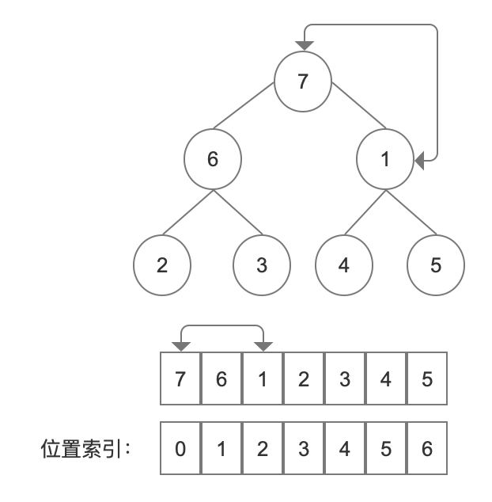

# 堆排序

参考 

- [https://www.cnblogs.com/Java3y/p/8639937.html](https://www.cnblogs.com/Java3y/p/8639937.html)
- [https://www.cnblogs.com/skywang12345/p/3602162.html](https://www.cnblogs.com/skywang12345/p/3602162.html)
- [https://baijiahao.baidu.com/s?id=1633787468367767177&wfr=spider&for=pc](https://baijiahao.baidu.com/s?id=1633787468367767177&wfr=spider&for=pc)

堆排序(Heapsort)是指利用堆积树（堆）这种数据结构所设计的一种排序算法，它是选择排序的一种. 堆分为大根堆和小根堆, 是完全二叉树.

**什么是完全二叉树? **
完全二叉树, 即: **Complete Binary Tree**

> A Complete Binary Tree （CBT) is a binary tree in which every level, 
> except possibly the last, is completely filled, and all nodes 
> are as far left as possible.

完全二叉树从根结点到倒数第二层满足完美二叉树，最后一层可以不完全填充，其叶子结点都靠左对齐。


**完全二叉树的性质**

- 左边子结点索引 = 当前父结点索引的2倍 + 1
- 右边子结点索引 = 当前父结点索引的2倍 + 2
- n个元素，叶子结点分别是：n/2+1(向下取整), n/2+2, ..., n  比如[7, 6, 1, 2, 3, 4, 5]这一共7个元素，则叶子结点从第7/2 +1开始，即从第4个开始住后是叶子结点 [注：如果按索引从0开始，则第4个，对应的索引index为3]
- n个元素，如果从1开始，第一个非叶子结点为：n/2, 比如[7, 6, 1, 2, 3, 4, 5]这一共7个元素，第一个非叶子结点为：7/2 (向下取整) = 3;  如果从0开始，第一个非叶子结点为：(n+1)/2 - 1, 比如比如[7, 6, 1, 2, 3, 4, 5]这一共7个元素，最大索引为6，第一个非叶子结点为：(6+1)/2 - 1 = 2



**什么是大根堆和小根堆**

`大根堆`又被称为`最大堆`是所有的父结点 >= 子结点, `小根堆`又被称为`最小堆`是所有的父结点 <= 子结点. 大根堆通常被用来进行"升序"排序，而小根堆通常被用来进行"降序"排序. 假设是大根堆, 可知根结点元素一定是这个堆中的最大值.

**思想**
这里讨论使用大根堆进行升序排序的基本思想：
1. 初始化堆：将数列a[1...n]构造成最大堆
2. 交换数据：将a[1]和a[n]交换，使a[n]是a[1...n]中的最大值；然后将a[1...n-1]重新调整为最大堆。 接着，将a[1]和a[n-1]交换，使a[n-1]是a[1...n-1]中的最大值；然后将a[1...n-2]重新调整为最大值。 依次类推，直到整个数列都是有序的.

下面开始堆排序, 这里我们讨论大根堆：当前每个父节点都 >= 子节点.
假设当前元素如下:


我们一层层交换数据, 把最大值7放在根部, 然后把7和数组中最后一位数交换, 这样最大值就在最后一位了, 这就是一趟排序, 然后再对除最后一个元素外的剩下的元素今次处理. 通过不断的建堆，交换....建堆，交换...建堆，交换...建堆，交换..达到排序结果. 

依上图，我们可以把上图的[1, 6, 7, 2, 3, 4, 5]看成一个完全二叉树，先从非叶子结点的最后一位7(索引为2开始)，发现子树[7, 4, 5]符合，再看6，发现子树[6， 2，3 ]符合，再看根结点为1，发现[1, 6, 7]不符合，这时候交换1和7，交换之后变成：



这就是一次排序过程，一次过后，根结点元素就是最大元素，然后把根结点值放在最后，数组变成了：


即每一次排序都会让根结点的值变成最大的，然后把根结点的值交换到数组的最后位置。

下面我们把整个堆排序的图示全部列出：


**java代码示例**

```java
public class HeapSort {
    public static void sort(int[] src) {  
        int maxIndex = src.length - 1;
        // buildHeap(src, 6, 2)
        // buildHeap(src, 5, 2)
        // buildHeap(src, 4, 1)
        // buildHeap(src, 3, 1)
        // buildHeap(src, 2, 0)
        // buildHeap(src, 1, 0)
        for (int i = src.length - 1; i > 0; i--) {
            System.out.println("maxIndex: " + maxIndex);
            buildHeap(src, maxIndex);
            swap(src, maxIndex, 0);
            System.out.println();

            --maxIndex;
        }

        System.out.println("排序结果：");
        for (int value : src) {
            System.out.print(value + "  ");
        }
    }

    /**
     * 一次建堆排序，得到一个最大值放入末尾
     * @param src 数组
     * @param maxIndex 最大索引位置
     * @param index 最后一个非叶子结点的索引位置
     */
    public static void buildHeap(int[] src, int maxIndex) {
        int index = (maxIndex+1) / 2 - 1;
        for (int i = index; i >= 0; i--) { // 非叶子结点的索引
            // System.out.println("索引： " + i);
            int maxPosition = i;
            int left = i*2 + 1;
            int right = i*2 + 2;
            int current = src[i];
            if (left <= maxIndex && current < src[left]) {
                maxPosition = left;
                current = src[maxPosition];
            }
            if (right <= maxIndex && current < src[right]) {
                maxPosition = right;
            }
            if (maxPosition != i) {
                swap(src, maxPosition, i);
            }
        }
    }

    public static void swap(int[] src, int i, int j) {
        System.out.println("交换：" + src[i] + "< === > " + src[j]);
        int temp = src[i];
        src[i] = src[j];
        src[j] = temp;
    }

    public static void main(String[] args) {
        // int[] src = new int[] {1, 6, 7, 2, 3, 4, 5};
        // int[] src = new int[] {12, 11, 13, 5, 6, 7};
        int[] src = new int[] {12, 11, 1, 6, 7, 2, 3, 4, 5, 12, 12, 13, 5, 5, 6, 7};
        HeapSort.sort(src);
    }
}
```