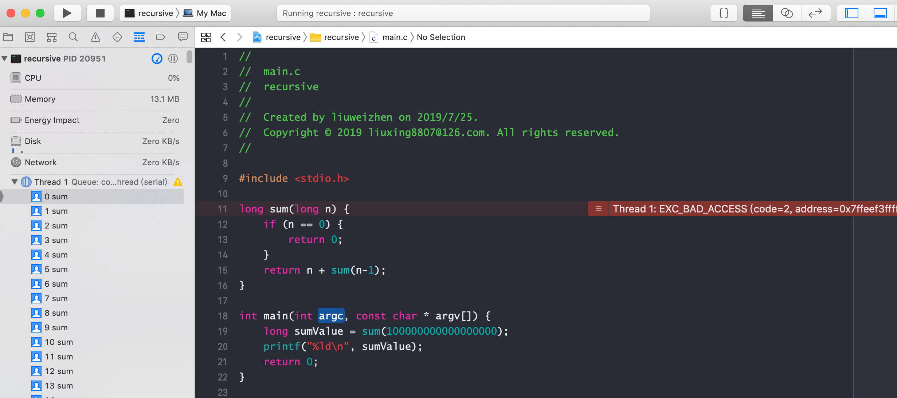

# 尾递归

[尾递归](https://baike.baidu.com/item/%E5%B0%BE%E9%80%92%E5%BD%92/554682)严格来说不算什么算法，而是一种编译器技巧。

先来看一个示例（编码工具：XCode）：

```C
long sum(long n) {
    if (n == 0) {
        return 0;
    }
    return n + sum(n-1);
}

int main(int argc, const char * argv[]) {
    long sumValue = sum(100000000000000000);
    printf("%ld\n", sumValue);
    return 0;
}
```



这是因为每次对于 sum 的递归调用都需要在调用栈上保存当前状态，否则我们就无法计算最后的 n + sum(n - 1)。当 n 足够大，调用栈足够深的时候，栈空间将被耗尽而导致错误，也就是我们常说的栈溢出(stack overflow)了。

**尾递归**
接下来看尾递归：当递归调用是整个函数体中最后执行的语句且它的返回值不属于表达式的一部分时，这个递归调用就是尾递归。尾递归函数的特点是在回归过程中不用做任何操作，这个特性很重要，因为大多数现代的编译器会利用这种特点自动生成优化的代码。
在上面的代码中虽然递归语句`n + sum(n-1)`是最后一行，但是由于需要和n相加，所以它是表达式的一部分，不是一个纯粹的递归语句，因此它不是尾递归。
当编译器检测到一个函数调用是尾递归的时候，它就覆盖当前的活动记录而不是在栈中去创建一个新的。编译器可以做到这点，因为递归调用是当前活跃期内最后一条待执行的语句，于是当这个调用返回时栈帧中并没有其他事情可做，因此也就没有保存栈帧的必要了。通过覆盖当前的栈帧而不是在其之上重新添加一个，这样所使用的栈空间就大大缩减了，这使得实际的运行效率会变得更高。

我们尝试把上面的代码改成尾递归的形式:

```C
long tailSum(long n, long current) {
    if (n == 0) {
        return current;
    }
    else {
        return tailSum(n - 1, current+n); // 尾递归
    }
}

long sum(long n) {
    return tailSum(n, 0);
}
```

[注]：在上面的示例中，笔者试验环境XCode, 按尾递归的写法依然栈帧溢出，这是由于Debug模式下编译器未做优化，需改为Release模式即可，但发现改为Release模式编译，上面两种写法都不会出现栈溢出，这是现代编译器的智能之处。

再举一示例，摘自[这里](https://baike.baidu.com/item/%E5%B0%BE%E9%80%92%E5%BD%92/554682)

假设给定一个整数n, 计算n * (n-1) * (n-2) * (n-3) * ... * 1, 如果采用原始线性递归方式：

```C
long recursive(long n) {
    return (n == 1) ? 1 : n * recursive(n - 1);
}
```

当n=5时，展开：

```
recursive(5)
{ 5 * recursive(4) }
{ 5 * { 4 * recursive(3) } }
{ 5 * { 4 * { 3 * recursive(2) } } }
{ 5 * { 4 * { 3 * { 2 * recursive(1) } } } }
{ 5 * { 4 * { 3 * { 2 * 1 } } } }
{ 5 * { 4 * { 3 * 2 } } }
{ 5 * { 4 * 6 } }
{ 5 * 24 }
120
```


尾递归方式：

```C
long recursive(long n, long current) {
    return (n == 1) ? current : recursive(n - 1, current * n);
}

long tailRecursive(long n) {
    return recursive(n, 1);
}
```

当n=5时，展开：

```
tailRecursive(5)
{ recursive(5, 1) }
{ recursive(4, 5) }
{ recursive(3, 20) }
{ recursive(2, 60) }
{ recursive(1, 120) }
120
```
