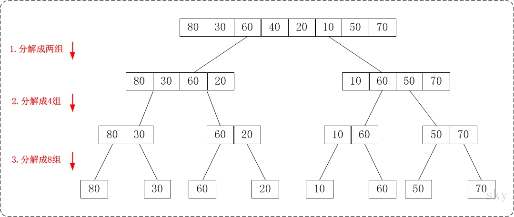

# 归并排序

归并排序（英语：Merge sort，或mergesort），是创建在归并操作上的一种有效的排序算法，效率为O(n log n)。1945年由约翰·冯·诺伊曼首次提出。该算法是采用分治法（Divide and Conquer）的一个非常典型的应用，且各层分治递归可以同时进行。

归并排序的核心思想是将两个有序的数列合并成一个大的有序的序列。通过递归，层层合并，即为归并.



我们先来分析一个特殊排序的例子——假设存在数组A和数组B，A和B都是顺序排序的，现在需要将这两个顺序排序的数组进行合并得到数组C,并且保证合并后数组有序。

**java**

```java
int [] A = new int[]{4,5,6,10,12,17};
int [] B = newint[]{1,3,8,9,15,20,32,50};
```

由于数组A和数组B都是排序数组，所以合并这两个数组，并且保持有序是可以在线性时间完成的，上述的合并排序过程用代码描述如下：

```java
class Sort {
    public static void main(String[] args) {
        int[] A = new int[] {4,5,6,10,12,17};
        int[] B = new int[] {1,3,8,9,15,20,32,50};

        int indexA = 0;
        int indexB = 0;
        int[] C = new int[A.length+B.length];
        int indexC = 0;
        while (indexA < A.length && indexB < B.length) {
            if (A[indexA] < B[indexB]) {
                C[indexC++] = A[indexA++];
            } else {
                C[indexC++] = B[indexB++];
            }
        }
        while (indexA < A.length) {
            C[indexC++] = A[indexA++];
        }
        while (indexB < B.length) {
            C[indexC++] = B[indexB++];
        }

        System.out.println("Sorted: ");
        for (int a : C) {
            System.out.print(" " + a);
        }
    }
}
```

通过分析上述代码的实现过程，只要数组A和数组B是排序数组，那么在线性时间内可以完成两个数组的合并。按照这个思想，如果一个数组A中的元素分成左右是有序的，排序起来就很方便，那么如果再把左右这各1/2分成1/4, 如果1/4是有序的，1/8是有序的...结束条件是分到1/N不能分为止。

完整算法：

**java版**

```java
public class MergeSort {
    public void sort(int[] A) {
        this.sort(A, 0, A.length-1);
    }

    public void sort(int[] A, int start, int end) {
        if (start >= end) return;
        int middle = (start+end) / 2;
        sort(A, start, middle);
        sort(A, middle+1, end);
        int[] temp = new int[end-start+1];
        int i = start;
        int j = middle+1;
        int index = 0;
        while (i <= middle && j <= end) {
            if (A[i] <= A[j]) {
                temp[index++] = A[i++];
            }
            else {
                temp[index++] = A[j++];
            }
        }
        while (i <= middle) {
            temp[index++] = A[i++];
        }
        while (j <= end) {
            temp[index++] = A[j++];
        }
        i = start;
        index = 0;
        for (; i <= end; i++) {
            A[i] = temp[index++];
        }
    }
    
    public static void main(String[] args) {
        int[] A = {8, 1, 32, 3, 10, 9, 15, 20, 6, 50};
        MergeSort mergeSort = new MergeSort();
        mergeSort.sort(A);
        for (int a : A) {
            System.out.print(" " + a);
        }
    }
}
```

**python版**

```Python
def sort(arr, start, end):
    if (start >= end):
        return

    middle = int((start+end) / 2)
    print("start: ", start)
    print("end: ", end)
    sort(arr, start, middle)
    sort(arr, middle+1, end)
    tempArr = [0]*(end - start + 1)
    i = start
    j = middle + 1
    index = 0
    while i <= middle and j <= end:
        if arr[i] <= arr[j]:
            tempArr[index] = arr[i]
            i += 1
        else:
            tempArr[index] = arr[j]
            j += 1
        index += 1
    while i <= middle:
        tempArr[index] = arr[i]
        index += 1
        i += 1
    while j <= end:
        tempArr[index] = arr[j]
        index += 1
        j += 1
    i = start
    index = 0
    for k in range(start, end+1):
        arr[k] = tempArr[index]
        index += 1

A = [8, 1, 32, 3, 10, 9, 15, 20, 6, 50];
sort(A, 0, len(A)-1)
for i in A:
    print(i, end=' -- ')
```


