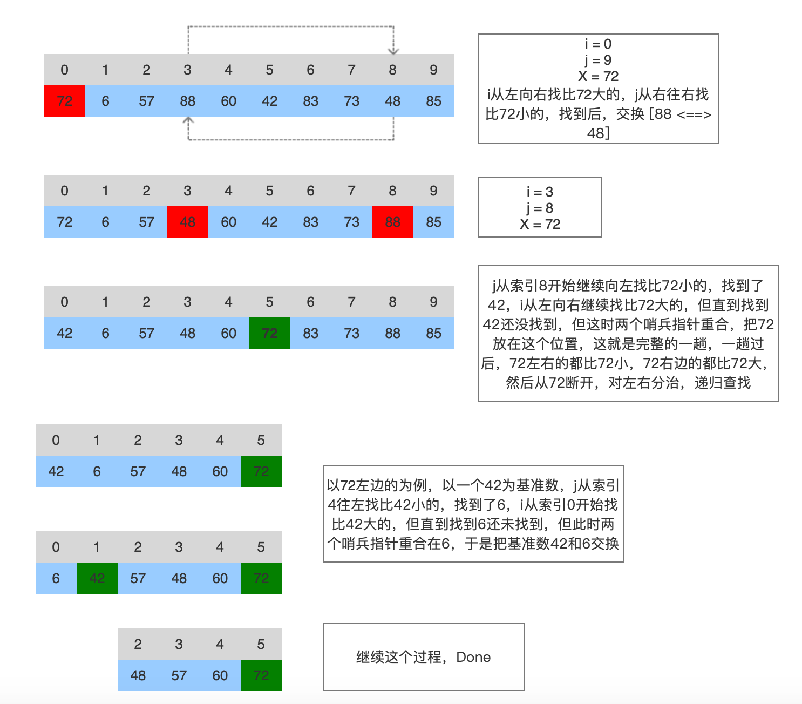

# 快速排序


快速排序使用分治法（Divide and conquer['kɑŋkɚ, 战胜，征服；攻克，攻取]）策略来把一个序列（list）分为较小和较大的2个子序列，然后递归地排序两个子序列。

步骤为：

挑选基准值：从数列中挑出一个元素，称为"基准"（pivot[ ['pɪvət]]）;
分割：重新排序数列，所有比基准值小的元素摆放在基准前面，所有比基准值大的元素摆在基准后面（与基准值相等的数可以到任何一边）。在这个分割结束之后，对基准值的排序就已经完成;
递归排序子序列：递归地将小于基准值元素的子序列和大于基准值元素的子序列排序。
递归到最底部的判断条件是数列的大小是零或一，此时该数列显然已经有序。

选取基准值有数种具体方法，此选取方法对排序的时间性能有决定性影响。

快速排序的算法由选择基准pivot的不同而可能也不同，但所有的快速排序算法都是“一趟排序过后，基准值的左边<基准值<基准值右边”
即：通过一趟排序将要排序的数据分割成独立的两部分：分割点左边都是比它小的数，右边都是比它大的数

假设以第一个数为基准pivot, 算法图示：



**C语言版**

```C
#include <stdio.h>

void quick_sort(int s[], int l, int r) {
    if (l < r) {
        int i = l, j = r, x = s[l]; // 基数选择第一个数
        while (i < j) {
            while (i < j && s[j] >= x) // 从右向左依次找第一个小于x的数, 如果当前值大于x, j指针前移一位
                j--;
            if (i < j)
                s[i++] = s[j]; // 从右向左找到比x小的值后，赋给i指向的位置
            while (i < j && s[i] < x) // 从左向右找第一个大于x的数, 如果当前值小于x, i指针向后移一位
                i++;
            if (i < j)
                s[j--] = s[i]; // 从左向左找到后赋给j指向的位置
        }
        s[i] = x;
        quick_sort(s, l, i - 1);
        quick_sort(s, i+1, r);
    }
}

int main(int argc, const char * argv[]) {
    int s[10] = {72, 6, 57, 88, 60, 42, 83, 73, 48, 85};
    quick_sort(s, 0, 9);
    for (int i = 0; i < 9; i++) {
        printf("%4d", s[i]); // 6  42  48  57  60  72  73  83  85
    }
    printf("\n\n");
    return 0;
}
```

上面是选择第一个值作为基准值，下面我们把最后一个值作为基准值：
[参考这里](https://www.runoob.com/python3/python-quicksort.html)

**Python版**

```Python
#!/usr/bin/python3

def partition(arr,low,high):
    i = ( low-1 )         # 最小元素索引
    pivot = arr[high]

    for j in range(low , high):

        # 当前元素小于或等于 pivot
        if  arr[j] <= pivot:
            i = i+1
            print("i === ", i, " j == ", j)
            arr[i],arr[j] = arr[j],arr[i]
            print("arr[i]:", arr[i], " arr[j]", arr[j])

    arr[i+1],arr[high] = arr[high],arr[i+1]
    return ( i+1 )


# 快速排序函数
def quickSort(arr,low,high):
    if low < high:

        pi = partition(arr,low,high)

        quickSort(arr, low, pi-1)
        quickSort(arr, pi+1, high)

arr = [72, 6, 57, 88, 60, 42, 83, 73, 48, 85]
quickSort(arr, 0, len(arr)-1)
print(arr)
```

接下来我用面向对象思想写一个可指定任意索引做为基准值的算法，效率可能会低一些：

**Python version**

```Python

class Parser:
    smaller = []
    bigger = []
    pivot = 0

    def __init__(self, arr, pivotIndex):
        tup = self.partial(arr, pivotIndex)
        self.smaller = tup[0]
        self.pivot = arr[pivotIndex]
        self.bigger = tup[2]

    # 把parser分成三部分：smaller, pivot, bigger
    def partial(self, arr, pivotIndex):
        smaller = []
        bigger = []
        pivot = arr[pivotIndex]

        for i in range(0, len(arr)):
            if i == pivotIndex:
                continue
            item = arr[i]
            if item < pivot:
                smaller.append(item)
            else:
                bigger.append(item)
        self.log(bigger)

        return (smaller, pivotIndex, bigger)

    def getSortedList(self):
        sortedList = []

        # arr = [72, 6, 57, 88, 60, 42, 83, 73, 48, 85]

        if len(self.smaller) > 1:
            p = Parser(self.smaller, 0)
            sortedList.extend(p.getSortedList())
        else:
            if len(self.smaller) == 1:
                sortedList.extend(self.smaller)

        sortedList.append(self.pivot)

        if len(self.bigger) > 1:
            p = Parser(self.bigger, 0)
            sortedList.extend(p.getSortedList())
        else:
            if len(self.bigger) == 1:
                sortedList.extend(self.bigger)

        return sortedList

    def log(self, arr):
        for i in range(0, len(arr)):
            print(arr[i])
```

```Python
#!/usr/bin/python3

# test.py 测试代码

from Parser import *

arr = [72, 6, 57, 88, 60, 42, 83, 73, 48, 85]

if __name__ == '__main__':
    parser = Parser(arr, 3)
    sortArr = parser.getSortedList()
    print("============== sorted arr:")
    logger.log(sortArr)

```
