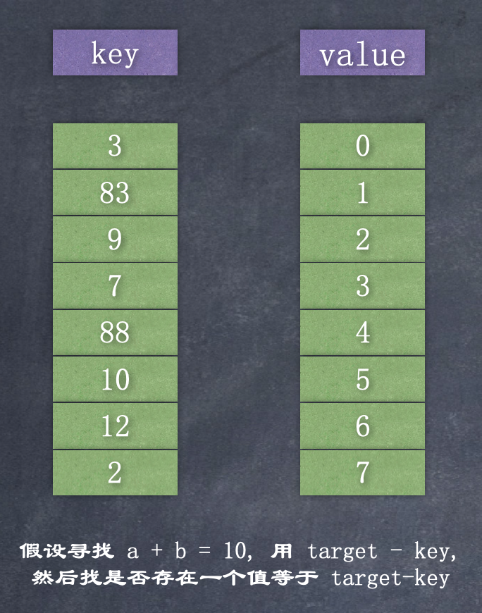

# 2sum

- [https://leetcode-cn.com/problems/two-sum/](https://leetcode-cn.com/problems/two-sum/)  

给定一个整数数组 nums 和一个目标值 target，请你在该数组中找出和为目标值的那 两个 整数，并返回他们的数组下标。
你可以假设每种输入只会对应一个答案。但是，数组中同一个元素不能使用两遍  

即找到数组nums中的两个数a和b, 使a + b = target 

示例:  

```
给定 nums = [2, 7, 11, 15], target = 9

因为 nums[0] + nums[1] = 2 + 7 = 9
所以返回 [0, 1]
```

### 暴力法  

```java
class Solution {
    public int[] twoSum(int[] nums, int target) {
        for (int i = 0; i < nums.length; i++) {
            for (int j = i + 1; j < nums.length; j++) {
                if (nums[i] + nums[j] == target) {
                    return new int[] { i, j };
                }
            }
        }
        throw new IllegalArgumentException("No two sum solution");
    }
}
```

复杂度分析：

时间复杂度：$$O(n^2)$$  
空间复杂度：$$O(1)$$

----------------------------------------

### 方法二：两遍哈希表  

通过以空间换取速度的方式，我们可以将查找时间从 O(n)O(n) 降低到 O(1)O(1)。哈希表正是为此目的而构建的，它支持以 近似 恒定的时间进行快速查找  



```java
class Solution {
    public int[] twoSum(int[] nums, int target) {
        Map<Integer, Integer> map = new HashMap<>();
        for (int i = 0; i < nums.length; i++) {
            map.put(nums[i], i);
        }
        for (int i = 0; i < nums.length; i++) {
            int complement = target - nums[i];
            if (map.containsKey(complement) && map.get(complement) != i) {
                return new int[] {i, map.get(complement)};
            }
        }
        throw new IllegalArgumentException("No two sum solution");
    }
}
```

复杂度分析：

时间复杂度：$$O(n)$$
我们把包含有 n 个元素的列表遍历两次。由于哈希表将查找时间缩短到 $$O(1)$$，所以时间复杂度为 $$O(n)$$

空间复杂度：$$O(n)$$
所需的额外空间取决于哈希表中存储的元素数量，该表中存储了 n 个元素  

----------------------------------------

### 方法三：一遍哈希表 
在往哈希表中存值时做检查  

```java
class Solution {
    public int[] twoSum(int[] nums, int target) {
        Map<Integer, Integer> map = new HashMap<>();
        for (int i = 0; i < nums.length; i++) {
            int complement = target - nums[i];
            if (map.containsKey(complement)) {
                return new int[] { map.get(complement), i };
            }
            map.put(nums[i], i);
        }
        throw new IllegalArgumentException("No two sum solution");
    }
}
```


