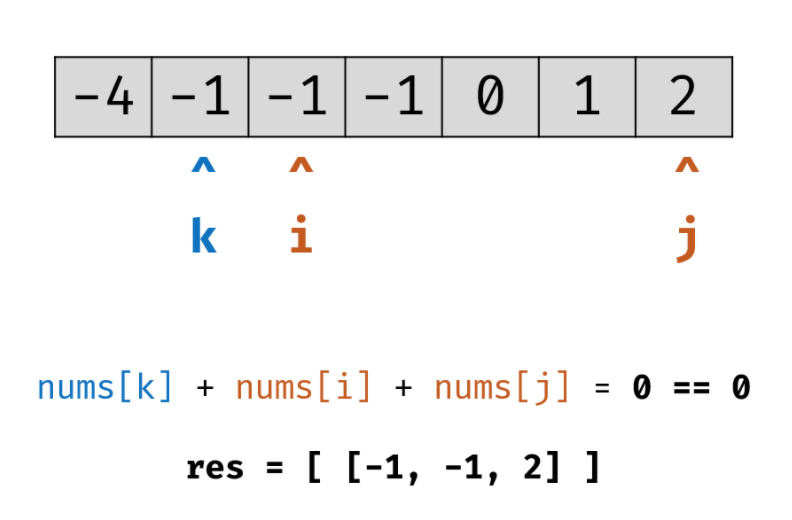

# 3sum

三数之和问题

- [https://leetcode-cn.com/problems/3sum/](https://leetcode-cn.com/problems/3sum/) 

给你一个包含 n 个整数的数组 nums，判断 nums 中是否存在三个元素 a，b，c ，使得 a + b + c = 0 ？请你找出所有满足条件且不重复的三元组

注意：答案中不可以包含重复的三元组  

**示例**

```
给定数组 nums = [-1, 0, 1, 2, -1, -4]，

满足要求的三元组集合为：
[
  [-1, 0, 1],
  [-1, -1, 2]
]
```

### 暴力法

```java
import java.util.*;

public class Sum3 {
    public static void main(String[] args) {
        int[] nums = {-1, 0, 1, 2, -1, -4};
        List<List<Integer>> resList = threeSum(nums);
        for (List<Integer> list : resList) {
            for (Integer n : list) {
                System.out.print(n + " ");
            }
            System.out.println();
        }
    }

    // https://leetcode-cn.com/problems/3sum/solution/san-shu-zhi-he-javajian-ji-ti-jie-by-wang-zi-hao-z/
    public static List<List<Integer>> threeSum(int[] nums) {
        if (nums == null || nums.length <= 2) {
            return Collections.emptyList();
        }
        Arrays.sort(nums);
        // 因为题目要求不可以包含重复的三元组, 因此使用Set集合处理
        // 否则会出现重复元素:
        // [-1,-1,2]
        // [-1,0,1]
        // [-1,0,1]
        Set<List<Integer>> result = new LinkedHashSet<>();
        // List<List<Integer>> result = new ArrayList<>();
        for (int i = 0; i < nums.length - 2; i++) {
            for (int j = i + 1; j < nums.length - 1; j++) {
                for (int k = j + 1; k < nums.length; k++) {
                    if (nums[i] + nums[j] + nums[k] == 0) {
                        result.add(Arrays.asList(nums[i], nums[j], nums[k]));
                    }
                }
            }
        }
        return new ArrayList<>(result);
        // return result;
    }
}
```

三层循环, 时间复杂度为: $$O(n^3)$$

---------------------------------------------------------

### 排序+双指针

这个题目可以转成2sum问题的转化, 即 a + b + c = 0, 找出 a + b = -c, 比较a + b 和 c 的值, 当a + b 小于c时, 左指针右移, 移到更大的数, 当a + b大于c时, 右指左移, 移到更小数, 当然也可以说是如果 a + b + c < 0, 左指针右移, a + b + c > 0, 右指针左移

- 前提: 先将给定的nums排序
- 双指针中间推移(夹逼法)

以[这里](https://leetcode-cn.com/problems/3sum/solution/3sumpai-xu-shuang-zhi-zhen-yi-dong-by-jyd/)的图解示例, 假设原始数据为:  `[-1, 0, 1, 2, -1, -4]`

首先对它进行排序: 


让k指向排序好的最左边(最小)的元素, 然后左指针为i, 右指针为j, i和j指向k后面的数组的最左和最右边, 这里把k指向的元素取负数作为target, 即target = -nums[k] = 4, 对比nums[i] + nums[j] 和 target的值, 如果nums[i] + nums[j] < target, 则i指针往后移动, 如果nums[i] + nums[j] > target, 则j指针往前移动


当i和j重合时依然没有找到, 则k指针往后移, 同样让i和j分别指向k后面数组的最左边和最右边, 然后继续比较, 发现找到一组合适的组合: `[-1, -1, 2]`:



找到之后把这组数据加入到目标数组, 然后继续把i往后移动, 移动后由于nums[i]和nums[i-1]值相同, 这时候忽略i, 让i继续往后移, 之所以可以继续移动i, 是因为k指向-1, i指向-1的情况已考虑过了, k没有移动的情况下, 再考虑i指向-1的这种情况是重复数据;   
然后j往前移, 只所以j可以往前移, 是因为如果j不移动, 是不存在三数相加为0的情况, 因为数组是排好序的, 前面找到了三数相加正好等于0的情况, 如果 j不动的情况下, 三数相加肯定要大于0;  
把i往前移,j往后移之后, 指各如下: 


于是又找到一个: `[-1, 0, 1]`, 然后继续直到i和j重合


i和j重合之后, 就可以把k指针往后移了, 只要nums[k]和nums[k-1]相同, k就一直往后移, 只所以这种情况下k可以往后移, 是因为以上述为例, k等于-1的情况已经考虑过了, 再遇到k=-1可以继续走, 否则是重复数据, 直接k往右移到了非-1的位置, 即指向数字0, 然后把i和j分别指向k后面数组的最左和最右边, 这时候三个指针的指向为: 


由于nums[k] + nums[i] + nums[j] > 0, 因此j往左移, 这时候和i重合了:


同时k也走到了nums.length - 2, 循环结束.  

上面的算法外层k循环复杂度$$O(N)$$, 内部双指针 `i`，`j` 复杂度 $$O(N)$$, 因此总体时间复杂度为$$O(N^2)$$, 空间复杂度为$$O(1)$$：指针使用常数大小的额外空间  

对应的[Java代码](https://leetcode-cn.com/problems/3sum/solution/3sumpai-xu-shuang-zhi-zhen-yi-dong-by-jyd/):  

```java
class Solution {
    public List<List<Integer>> threeSum(int[] nums) {
        // 前提:先排好序
        Arrays.sort(nums);
        List<List<Integer>> res = new ArrayList<>();
        for (int k = 0; k < nums.length - 2; k++) {
            // 当 nums[k] > 0 时直接break跳出：
            // 因为数组已排好序, nums[j] >= nums[i] >= nums[k] > 0，即 3 个数字都大于 0 ，在此固定指针 k 之后不可能再找到结果了
            if (nums[k] > 0) break;
            // 去除重复情况, nums[k-1]的情况已考虑过, 不需要再考虑相同的元素, k直接往右移
            if (k > 0 && nums[k] == nums[k-1]) continue;
            // 让左右指针(双指针)i和j分别指向k后面的数组的最左边和最右边
            int i = k + 1, j = nums.length - 1;
            while (i < j) { // 让i往右移, j往左移, 直接他们两个重合(夹逼法)
                int sum = nums[k] + nums[i] + nums[j];
                if (sum < 0) {
                    // sum < 0, 这说明值小了, 于是i往右移, 寻找更大的数
                    // i往右移后发现和前面的值相同, 则继续右移
                    // 因为在k不动的情况下, i右移之前和右移之后值相同, 这种nums[i]的情况已考虑过, 不需再考虑, 否则是重复数据
                    while (i < j && nums[i] == nums[++i]);
                } else if (sum > 0) {
                    // sum > 0, 这说明值大了, 于是j往左移, 寻找更小的数
                    // 同理去除nums[j]值相同的情况
                    while (i < j && nums[j] == nums[--j]);
                } else {
                    // 找到合适的数据, 加入res
                    res.add(new ArrayList<Integer>(Arrays.asList(nums[k], nums[i], nums[j])));
                    // 然后让i继续往右移, 如果有相同元素, 继续把i往右移
                    while (i < j && nums[i] == nums[++i]);
                    // j也要往左移, 因为找到了k, i, j指向的元素相加正好为0的情况
                    // 在k不动, i指向的元素发生了变化的情况下, j如果不左移是不可能相加正好为0的
                    // 所以j往左移, 并且同理去除重复元素的情况
                    while(i < j && nums[j] == nums[--j]);
                }
            }
        }
        return res;  
    }
}
```

