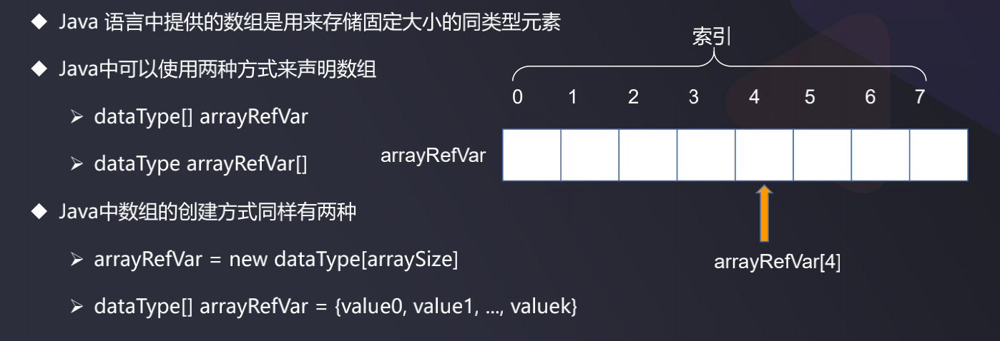

# 数组

- 数组是内存中一片连续的内存空间, 当申请数组时, 计算机在内存中开辟了一段连续的地址, 因此它可以随机访问任意一个元素, 访问数组中做任意一个元素的时间复杂度为 $$O(1)$$   
- 可以根据索引下标非常快地定位到某一个元素
- 但是新增、删除元素的时候需要移动元素位置以保证其连续，效率会变低

数组存在的问题: 在插入和删除元素的时候, 假设在插入元素时先要移动其他元素, 最好的情况是O(1), 最坏的情况是O(n), 然后再把要插入的元素插入进去, 同理, 删除也是一样   



来看一下Java中ArrayList在末尾添加元素的操作(时间复杂度O(1)):  

```java
// 在数组末尾添加, 直接添加即可
public boolean add(E e) {
  modCount++;
  if (size == data.length)
    ensureCapacity(size + 1);
  data[size++] = e;
  return true;
}
```

再来看Java中ArrayList源代码插入一个元素的操作:  

```java
public void add(int index, E e) {
    checkBoundInclusive(index); // 检查上下界
    modCount++; // 操作的次数
    if (size == data.length)
      ensureCapacity(size + 1);
    if (index != size)
      System.arraycopy(data, index, data, index + 1, size - index);
    data[index] = e;
    size++;
}
```

可以看到核心代码有两句:
```java
System.arraycopy(data, index, data, index + 1, size - index);
data[index] = e;
```
对于第一句, 前两个参数表示源, 紧跟着的两个参数是目标, 最后一个参数是要拷贝的数据元素个数, 整个意思是把源起点位置copy到目标起点位置, copy的长度为size-index, 即:  
把data数组中从index位置开始的数据  copy到  data数组中从index+1的位置开始    copy的长度为: size - index
比如data为: `[1][2][3][4][5][6][7][8]`
对应`add(int index, E e)`要插入的数据为: `add(5, 9)`, 也就是在索引为5的位置插入数字9, 于是:  
```java
[1][2][3][4][5][6][7][8]  -->  size = 8, index = 5  size-index = 3 
// 执行System.arraycopy之后, 元素[7]和[8]都往后移动一位
[1][2][3][4][5][6]   [7][8]

// 然后再执行 `data[index] = e;` 即 `data[5] = 9`:  
[1][2][3][4][5][6][9][7][8]
```

因此, 数组的插入操作的时间复杂度为 O(n)  
同理, 其删除操作同样是O(n):  

```java
/**
 * Removes the element at the specified position in this list.
 * Shifts any subsequent elements to the left (subtracts one from their
 * indices).
 *
 * @param index the index of the element to be removed
 * @return the element that was removed from the list
 * @throws IndexOutOfBoundsException {@inheritDoc}
 */
public E remove(int index) {
    rangeCheck(index);

    modCount++;
    E oldValue = elementData(index);

    int numMoved = size - index - 1;
    if (numMoved > 0)
        System.arraycopy(elementData, index+1, elementData, index,
                         numMoved);
    elementData[--size] = null; // clear to let GC do its work

    return oldValue;
}
```

分析: ArrayList和LinkedList的一些区别:
- ArrayList: 底层是数组, 因此它查询快, 插入慢, 有移动的动作. 
- LinkedList: 底层是链表, 在一定的范围内, 插入快, 查询慢

但是,如果是在数组末尾添加数据,效率是很高的, 因为这个时候有需要移动ArrayList中的其他元素, 来看一个示例:  

```java
import java.util.ArrayList;
import java.util.LinkedList;
import java.util.List;

public class Test1 {
    public static void main(String[] args) {
        addLinkedList();
        addArrayList();
    }

    private static void addLinkedList() {
        long begin = System.currentTimeMillis();
        List list = new LinkedList();
        for (int i = 0; i < 800000; i++) {
            list.add(i);
        }
        System.out.println("LinkedList time==" + (System.currentTimeMillis()-begin) + "ms"); // LinkedList time==40ms
    }

    private static void addArrayList() {
        long begin = System.currentTimeMillis();
        List list = new ArrayList();
        for (int i = 0; i < 800000; i++) {
            list.add(i);
        }
        System.out.println("ArrayList time==" + (System.currentTimeMillis()-begin) + "ms"); // ArrayList time==22ms
    }
}
```


