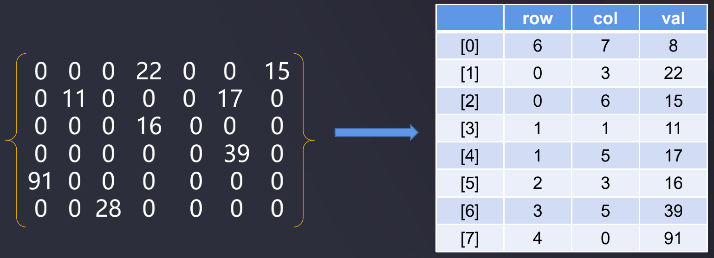
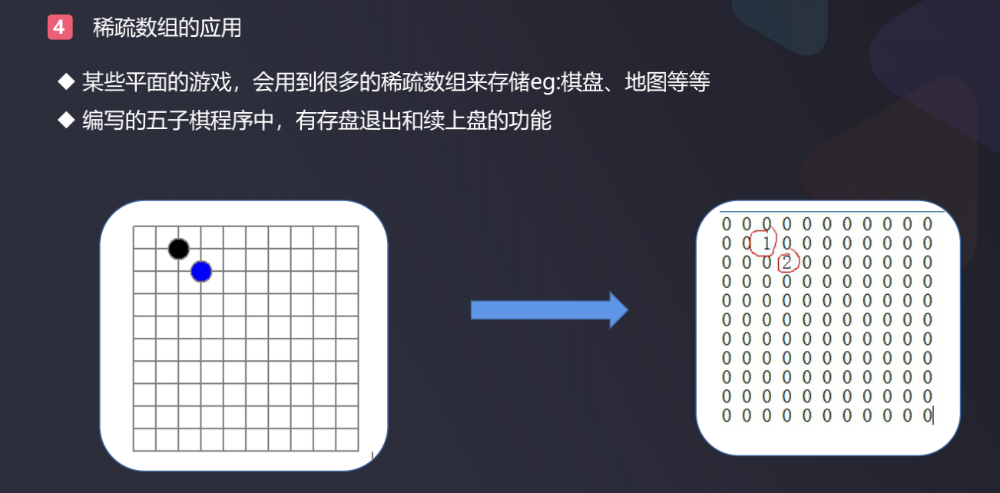

# 稀疏数组

### 稀疏数组 spare array

- 当数组中大部分元素为０，或者为同一个值的数组时，可以使用稀疏数组来保存该数组:
  - 记录数组一共有几行几列，有多少个不同的值
  - 把具有不同值的元素的行列及值记录在一个小规模的数组中，从而缩小程序的规模

  

  上图所示一共6行(row)和7列(col), 一共8个非0数据, 其中:  
  ```
  [0, 3] 22   // 索引为0行3列的数为22
  [0, 6] // 索引为0行6列的数为15
  [1, 1] // 索上为1行1列的数为11
  ...
  ```

这样就把6行7列的42个空间位置转换成了一共有3*8=24个空间位置

-------------------------------------------------------------------



下面程序把原棋盘二维数组转换为稀疏二维数组, 再从稀疏数组中恢复为原棋盘二维数组:

```java
public class ChessDemo {
    public static void main(String[] args) {
        // chessArr表示一个棋盘
        // 0表示没有落子,1表示白子,2表示黑子
        int[][] chessArr = new int[11][11];
        chessArr[1][2] = 1;
        chessArr[2][3] = 2;
        int[][] spareArr = getSpareArr(chessArr); // 棋盘二维数组 -> 稀疏数组
        int[][] recoverArr = getChessArr(spareArr); // 稀疏数组 -> 棋盘二维数组
        System.out.println("------------------------- 恢复后的二维数组 -------------------------");
        for (int[] row : recoverArr) {
            for (int item : row) {
                System.out.printf("%d\t", item);
            }
            System.out.println();
        }
    }

    // 将稀疏数组恢复为二维数组
    private static int[][] getChessArr(int[][] spareArr) {
        int row = spareArr[0][0];
        int col = spareArr[0][1];
        int num = spareArr[0][2];
        int[][] chessArr = new int[row][col];
        for (int i = 1; i < spareArr.length; i++) {
            int[] subArr = spareArr[i];
            chessArr[subArr[0]][subArr[1]] = subArr[2];
        }
        return chessArr;
    }

    // 根据原棋盘获取稀疏数组
    private static int[][] getSpareArr(int[][] chessArr) {
        // 打印出棋盘并计算出有多少个非空值
        int sum = 0;
        for (int[] row : chessArr) { // chessArr.length
            for (int item : row) {
                System.out.printf("%d\t", item);
                if (item != 0) {
                    sum ++;
                }
            }
            System.out.println();
        }
        /**
         0	0	0	0	0	0	0	0	0	0	0
         0	0	1	0	0	0	0	0	0	0	0
         0	0	0	2	0	0	0	0	0	0	0
         0	0	0	0	0	0	0	0	0	0	0
         0	0	0	0	0	0	0	0	0	0	0
         0	0	0	0	0	0	0	0	0	0	0
         0	0	0	0	0	0	0	0	0	0	0
         0	0	0	0	0	0	0	0	0	0	0
         0	0	0	0	0	0	0	0	0	0	0
         0	0	0	0	0	0	0	0	0	0	0
         0	0	0	0	0	0	0	0	0	0	0
         */

        // 创建稀疏数组
        int[][] spareArr = new int[sum+1][3]; // 行号 列号 值, 因此是3
        spareArr[0][0] = 11; // 11行
        spareArr[0][1] = 11; // 11列
        spareArr[0][2] = sum; // 一共有sum个非0数据

        // 补充数据到稀疏数组中
        int rowNum = 0; // 记录在稀疏数组中的行的索引, 原数组中有多少个非0数据, 稀疏数组中就有多少行+1
        for (int i = 0; i < chessArr.length; i++) {
            for (int j = 0; j < chessArr[0].length; j++) { // 11
                if (chessArr[i][j] != 0) {
                    rowNum++;
                    spareArr[rowNum][0] = i;
                    spareArr[rowNum][1] = j;
                    spareArr[rowNum][2] = chessArr[i][j];
                }
            }
        }
        // 输出稀疏数组
        System.out.println("------------------------- 输出稀疏数组 -------------------------");
        for (int i = 0; i < spareArr.length; i++) {
            System.out.printf("%d\t%d\t%d\n", spareArr[i][0], spareArr[i][1], spareArr[i][2]);
        }
        /**
         11	11	2
         1	2	1
         2	3	2
         */
        return spareArr;
    }
}
```