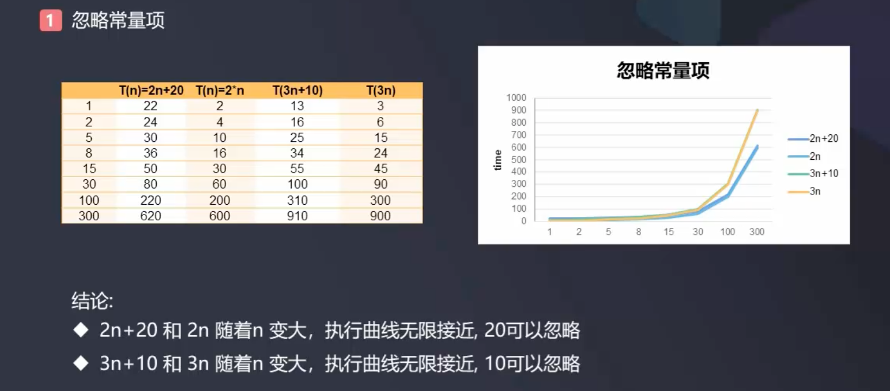

# 时间复杂度(Complexity)

**度量算法的执行时间**  
度量一个程序(算法)执行时间的两种方法:  
- 事后统计法
- 事前估算法

- 可以通过统计某个算法的时间复杂度来度量方法的优越性    
- 时间复杂度统计法属于事前估算法  

**时间频度T(n)**
- 一个算法花费的时间与算法中语句的执行次数成正比
- 一个算法中的语句执行次数称为语句频度或时间频度, 记为T(n), n称为问题的规模

**时间复杂度O(n)**   
- 某个函数f(n), 使得当n趋近于无穷大时, T(n)/f(n)的极限值为不等于零的常数, 则称f(n)是T(n)的同数量级函数. 记作: T(n) = O(f(n))   
- T(n)不同, 但时间复杂度可能相同
- 称O(f(n))为算法的渐近时间复杂度, 简称时间复杂度

**最坏时间复杂度**    
- 最坏情况下的时间复杂度称最坏时间复杂度
- 一般讨论的时间复杂度均是最坏情况下的时间复杂度
- 最坏情况下的时间复杂度是算法在任何输入实例上运行时间的界限

**平均时间复杂度**  
- 平均时间复杂度是指所有可能的输入实例均以等概率出现的情况下该算法的运行时间
- 平均时间复杂度和最坏时间复杂度是否一致, 和算法有关  

**空间复杂度**  
- 一个算法的空间复杂度(Space Complexity)定义为该算法所耗费的存储空间, 它也是问题规模n的函数
- 空间复杂度是对一个算法在运行过程中临时占用存储空间大小的度量
- 在做算法分析时, 更看重的是程序执行的速度
- 一些缓存产品(redis, memcache)和算法(基数排序)本质就是用空间换时间  

### 时间复杂度常用计算方式  

示例:  
```java
public class Test {
    public static void main(String[] args) {
        //计算0+1+2+3+4+...+100
        int sum = 0;
        int end = 100;
        //算法一
        for (int i = 0; i <= end; i++) {
            sum += i;
        }
        //算法二
        sum = (1+end)*end/2;
    }
}

- 算法一的时间频度T(n) = n + 1
- 算法二的时间频度T(n) = 1
- 根据时间频度可以推算时间复杂度
```

### 计算时间复杂度原则  

1. 忽略常量项

  

2. 忽略低次项  

  

3. 忽略系数  

 

4. 计算时间频度的方式 

 

### Big O notation  

- 常数阶 O(1): Constant Complexity
- 对数阶 O(log n): Logarithmic Complexity 
- 线性阶 O(n): Linear Complexity
- 线性对数阶: O(nlog_2n)
- 平方阶 O(n^2): N square Complexity
- 立方阶 O(n^3): N cubic Complexity 
- k次方阶: O(n^k)
- 指数阶: O(2^n): Exponential Growth
- O(n!): Factorial阶乘

 

注: 常数系数不予考虑, 比如O(1)常数复杂度, 可能是2, 3, 4..., 而O(n), 可能是2n, 3n...

**O(1)**
```java
int n = 1000;
System.out.println("Hey - your input is: " + n);
```

下面依然是O(1), 而无论n是多少,即时间复杂度是常数级的
```
int n = 1000;
System.out.println("Hey - your input is: " + n);
System.out.println("Hmm.. I'm doing more stuff with: " + n);
System.out.println("And more: " + n);
```

**O(n)**
O(n)线性复杂度:  
```java
for (int i = 1; i <= n; i++) {
    System.out.println("Hey - I'm busy looking at: " + i);
}
```

**O(n^2)**
```java
for (int i = 1; i <= n; i++) {
    for (int j = 1; j <= n; j++) {
        System.out.println("Hey - I'm busy looking at: " + i + " and" + j);
    }
}
```

**O(log(n))**
```
for (int i = 1; i < n; i = i*2) {
    System.out.println("Hey- I'm busy looking at: " + i);
}
```
- n = 2时, 对应的执行次数为: 1  
- n = 4时, 对应的执行次数为: 2
- n = 8时, 对应的执行次数为: 3
- n = 16时, 对应的执行次数为: 4
- n = 32时, 对应的执行次数为: 5

$执行次数 = \log_2n$, 因此时间复杂度为O(log(n)), 计算方式后续讨论

**O(k^n)**
这里的K是一个常数, 比如2的n次方, 3的n次方, 这里的2, 3即是K, Fibonacci, 指数级时间复杂度
```java
int fib(int n) {
    if (n <= 2) return n;
    return fib(n-1) + fib(n-2);
}
```


------------------------------------------------------------

一个示例: 

计算: 1 + 2 + 3 + 4 ... + n
一种解法: 

```java
int sum = 0;
for (int i = 1; i <= n; i++) {
        sum += i;
}
```
其时间复杂度为O(n)  
改进解法:  
`sum = n * (n+1)/2`, 时间复杂度为O(1)

------------------------------------------------------------

### 递归时间复杂度的分析   

### 示例: 求Fibonacci数列的第n项,  0, 1, 1, 2, 3, 5, 8, 13, 21 ...

- F(n) = F(n - 1) + F(n - 2) 

直接写法:  
```java
int fib(int n) {
    if (n <= 2) return n;
    return fib(n-1) + fib(n-2);
}
```
这种写法的时间复杂度为2的n次方, 计算递归的时间复杂度, 一般可画出递归状态树, 比如是N=8为例:  


每多展开一层, 下面一层的节点数就是上面一层的2倍, 即依次为 $2^{0}$、$2^{1}$、$2^{2}$、$2^{3}$、$2^{4}$ …，因此最终为$2^{n}$  

优化后的写法:  
```java
public long fabonacci(int n) {
    long a = 0, b = 1;
    if (n == 1) return a;
    else if (n == 2) return b;
    else {
        for (int i = 3; i <= n; i++) {
            b = a + b;
            a = b - a;
        }
        return b;
    }
}
```

优化写法2: 利用数组先存储数字，直接返回结果，耗费空间:  

```java
public static long fabonacci_2(int n) {
    long[] arr = new long[n+1];
    arr[1] = 0;
    arr[2] = 1;
    for (int i = 3; i <= n; i++) {
        arr[i] = arr[i-1] + arr[i-2];
    }
    return arr[n];
}
```

----------

计算递归算法的主定理 Master Theorem 


-----------------------------


