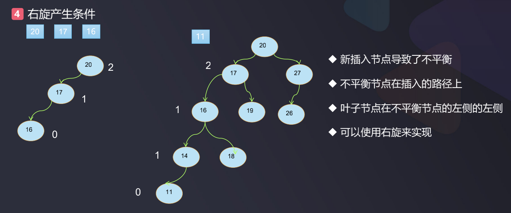
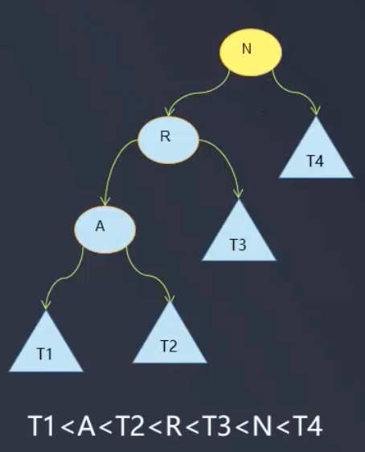
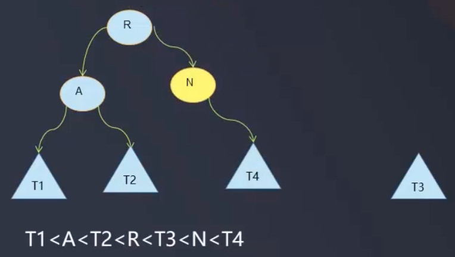
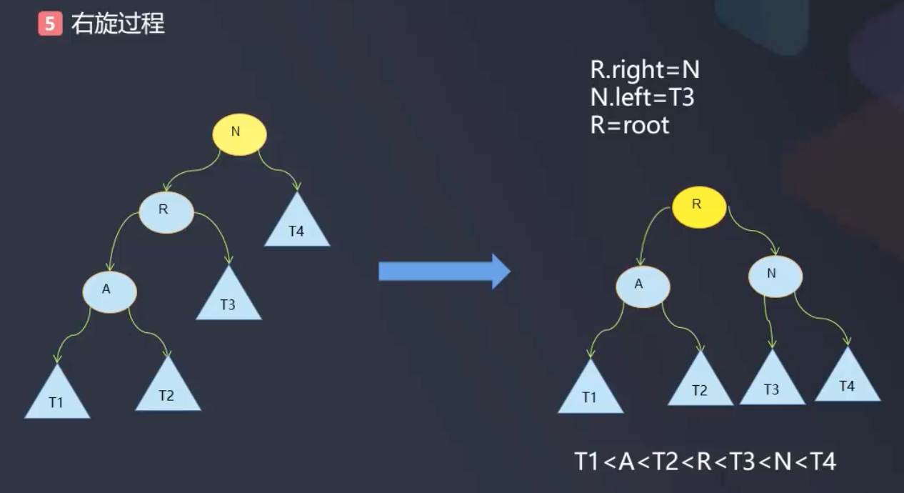
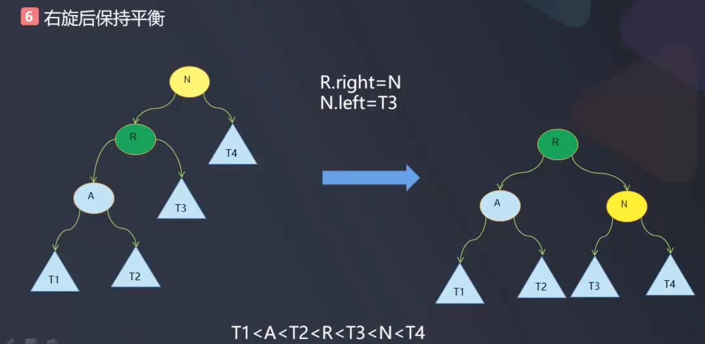
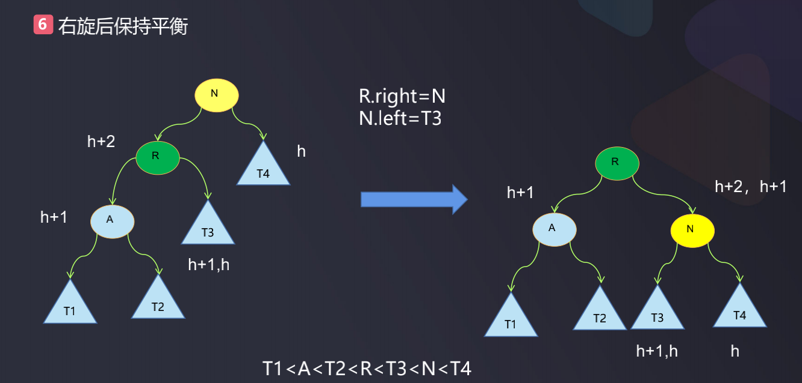
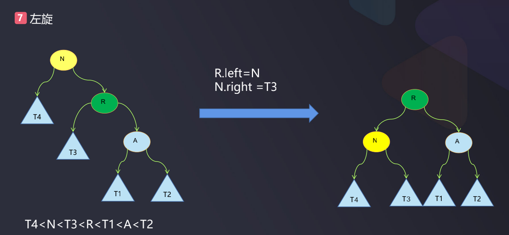

# AVL_LL导致不平衡分析

导致二叉树不平衡的原因之一是新插入节点导致不平衡, 比如:



- 对于左边的树, 当插入新节点16的时候, 节点20的平衡因子变成了2, 新插入的节点16在不平衡节点20左边的左边
- 对于右边的树, 本来这棵树是平衡的, 但是当插入新节点11时, 节点17的平衡因子变成了2, 树变成了不平衡的, 新插入的节点11在不平衡节点左边的左边(左边的左边并不是意味着一定要跨两个左边节点, 而是指跨度>=2)
- 这里的左边的左边, 即LL, LL是导致不平衡的一种情况
- 出现了LL, 就是右旋转产生的条件, 可以使用右旋转让树再次平衡

### LL以及右旋转再平衡的图示分析


如上图所示就是LL导致不平衡的情况, 图中:
- N代表非平衡节点
- R代表等一下右旋之后的根节点
- A无特别含义, 仅说明是AVL中的A, 即一般的AVL树中的节点

针对这种情况, 为了使之变成一个平衡的二叉树, 可以使用右旋转来处理:  

1. 首先为了让这棵树具有普遍性, 先进行补全操作
 

2. 下面进行右旋转   
```
R.right = N; // 把不平衡节点N挂载到它的右孩子R的右侧
```
这样就变成了:  
   

之后: 
```
N.left = T3;
root = R; // 注意root是相对的, 这里的root可能是子树的root
``` 

  

这样就完成了右旋转, 依然是一棵二叉搜索树, 而且是一棵平衡的二叉树

  

**右旋后变成平衡二叉树的证明**  

首先证明右旋转后它依然是一棵二叉树, 然后再证明它是一棵平衡的二叉树

  

按上图所示, 左边的树满足 `T1<A<T2<R<T3<N<T4`, 右旋之后:  
- 节点`R, A, T1, T2`和原来保持一致, 因此它依然满足`T1<A<T2<R`
- 在原左树中R本来就是小于T3的: `R<T3`
- 在原左树中由于T3在N的左子树上, 因此 `T3<N`
- 在原左树中N本来就是小于T4的: `N<T4`
- 综上, 旋转后依然满足: `T1<A<T2<R<T3<N<T4`, 因此旋转后依然是一棵二叉搜索树  

下面再来证明它是一棵平衡的二叉树:  

先来看左边的树, 寻找不平衡节点是逆序寻找的, 寻找到的第一个不平衡节点为N, 所以R和A一定是平衡的二叉树, 如下图所示, 假设:  
- T1的T2最大的高度为H, 则A的高度为: h+1
- 以R为根的二叉树也是平衡的, 所以R的右孩子T3的高度为: h+1或h
- R高度为为: h+2
- 由于N是逆序寻找(从叶子往上找)到的第一个不平衡节点, 所以N的平衡因子为2, 再根据R的高度为h+2, 计算可知T4的高度为: h

由上面的推算再来看右旋转后右边的树, 推导出R的平衡因子为: 0或1, 因此右旋转后的树是一棵平衡二叉树

  

### RR以及左旋转

根据上面的分析, 不平衡的LL二叉树通过右旋转再平衡, 同理, 对于不平衡的RR二叉树也可以通过左旋转再平衡

  