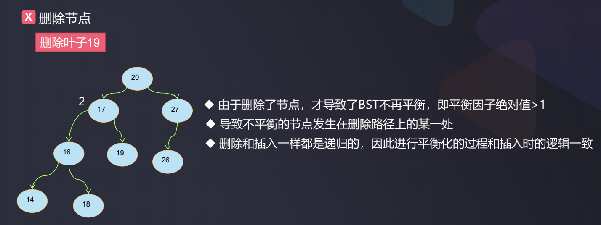
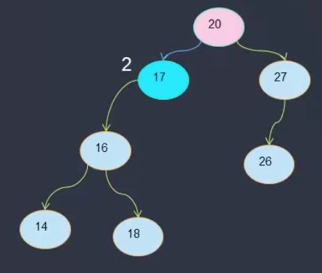

# AVL_删除节点

参考:
- https://www.javatpoint.com/deletion-in-avl-tree
- https://www.geeksforgeeks.org/avl-tree-set-1-insertion/
- https://www.geeksforgeeks.org/avl-tree-set-2-deletion/

除了添加节点时可能导致树不平衡之外, 删除节点也可能导致不平衡, 因此也需要相应的操作才能使树再平衡  



如上图, 如果删除了节点19, 则节点17的平衡因子就变成了2, 此时树不平衡  



完整代码实现:

```java
package com.daliu.tree;

import java.util.*;

//https://www.geeksforgeeks.org/avl-tree-set-2-deletion/
public class AVL <E extends Comparable<E>> {
    // 二分搜索树的节点
    private class Node {
        E e;
        Node left;
        Node right;
        public int height; //节点的高度

        public Node(E e) {
            this.e = e;
            this.left = null;
            this.right = null;
            this.height = 1;
        }

        @Override
        public String toString() {
            return "Node{" +
                    "e=" + e +
                    ", left=" + left +
                    ", right=" + right +
                    '}';
        }
    }

    private Node root;
    private int size; // 节点总个数
    public int size() {
        return size;
    }

    // 判断是不是二叉搜索树
    public boolean isBST() {
        // 二叉搜索树中序遍历得到的节点的集合是有序的
        // 使用这个特性判断是不是二叉搜索树
        ArrayList<E> elements = new ArrayList<>();
        //midOrder(elements);
        for (int i = 1; i < elements.size(); i++) {
            if (elements.get(i-1).compareTo(elements.get(i)) > 0) {
                return false;
            }
        }
        return true;
    }

    // 判断是不是平衡的
    public boolean isBalanced() {
        return isBalanced(root);
    }

    // 判断以node为根节点的树是不是平衡的
    private boolean isBalanced(Node node) {
        if (node == null) {
            return true;
        }
        // 获取平衡因子, 如果平衡因子大于1, 则不是平衡的
        int balanceFactor = getBalancedFactor(node);
        if (Math.abs(balanceFactor) > 1) return false;
        return isBalanced(node.left) && isBalanced(node.right);
    }

    // 获取平衡因子
    private int getBalancedFactor(Node node) {
        // 平衡因子 = abs(左子树.height - 右子树.height)
        if (node == null) return 0;
        return getHeight(node.left) - getHeight(node.right);
    }

    // 获取以node为根节点的树的高度
    private int getHeight(Node node) {
        if (node == null) return 0;
        return node.height;
    }

    public void addElement(E e) {
        root = addElement(root, e);
    }

    /**
     * 将元素E添加到以node为父节点的树上, 并返回这个父节点, 如果node为null, 则返回这个节点本身
     * @param node 要将元素添加到的父节点
     * @param e 元素
     * @return 新插入节点后的子树的根
     *
     * 注: 此方法暂未考虑值相同的情况, 值相同的情况忽略
     * https://www.geeksforgeeks.org/avl-tree-set-1-insertion/
     */
    public Node addElement(Node node, E e) {
        if (node == null) { // 递归的结束条件是递归到了叶子节点的下一个元素
            size++;
            return new Node(e);
        }
        if (e.compareTo(node.e) < 0) { // 往左侧走
            node.left = addElement(node.left, e); // 递归调用
        } else if (e.compareTo(node.e) > 0) { // 往右侧走
            node.right = addElement(node.right, e); // 递归调用
        }
        // 更新节点的高度, 节点的高度 = max(左子树高, 右子树高) + 1
        node.height = 1 + Math.max(getHeight(node.left), getHeight(node.right));
        // 更新节点的平衡因子
        int balance = getBalancedFactor(node);
        // 不平衡节点的左侧的左侧LL, 右旋再平衡
        // 由LL导致的不平衡节点:
        // 1. 平衡因子 > 1
        // 2. 左孩子的平衡因子 >= 0
        // LL > 右旋
        if (balance > 1 && e.compareTo(node.left.e) < 0) {
            return rightRotate(node); // LL > 右旋
        }
        // RR > 左旋
        if (balance < -1 && e.compareTo(node.right.e) > 0) {
            return leftRotate(node);
        }
        // LR > 左旋变成LL > 右旋
        if (balance > 1 && e.compareTo(node.left.e) > 0) {
            node.left = leftRotate(node.left);
            return rightRotate(node);
        }
        // RL > 右旋变成RR > 左旋
        if (balance < -1 && e.compareTo(node.right.e) < 0) {
            node.right = rightRotate(node.right);
            return leftRotate(node);
        }
        /* return the (unchanged) node pointer */
        return node;
    }

    // 对节点n进行向左旋转操作，返回旋转后新的根节点r
    //    n                             r
    //  /  \                          /   \
    // T1   r      向左旋转 (n)       n     a
    //     / \   - - - - - - - ->   / \   / \
    //   T2  a                     T1 T2 T3 T4
    //      / \
    //     T3 T4
    private Node leftRotate(Node node) {
        Node r = node.right;
        Node T2 = r.left;
        //左旋
        r.left = node;
        node.right = T2;
        //重新计算高度
        node.height = Math.max(getHeight(node.left), getHeight(node.right)) + 1;
        r.height = Math.max(getHeight(r.left), getHeight(r.right)) + 1;

        return r;
    }

    // n是不平衡节点，r是新的根节点，a是符合avl的子树的根节点
    // 对节点n进行向右旋转操作，返回旋转后新的根节点r
    //        n                              r
    //       / \                           /   \
    //      r   T4     向右旋转 (n)        a     n
    //     / \       - - - - - - - ->    / \   / \
    //    a   T3                       T1  T2 T3 T4
    //   / \
    // T1   T2
    private Node rightRotate(Node node) {
        Node r = node.left;
        Node T3 = r.right;

        //右旋转 Right rotation
        r.right = node;
        node.left = T3;

        //维护高度, n(node)和r的高度发生了变化
        //节点的高度=Max(左子树高, 右子树高)
        // Update heights
        node.height = Math.max(getHeight(node.left),getHeight(node.right))+1;
        r.height = Math.max(getHeight(r.left),getHeight(r.right))+1;

        // Return new root
        return r;
    }

    /**
     * 查找元素所在节点
     * @param e 元素
     * @return 元素所在节点
     */
    public Node search(E e) {
        return search(root, e);
    }

    /**
     * 在以node为根节点的树上查找元素e所在的节点
     * @param node 根节点
     * @param e 要查找的元素
     * @return e 所在的节点
     */
    private Node search(Node node, E e) {
        if (node == null) {
            return null;
        }
        if (e.compareTo(node.e) == 0) {
            return node;
        } else if (e.compareTo(node.e) < 0) { // 去左子树查找
            return search(node.left, e);
        } else { // 去右子树查找
            return search(node.right, e);
        }
    }

    /**
     * 查找指定元素的父节点
     * @param e 元素
     * @return 元素e的父节点
     */
    public Node searchParent(E e) {
        return searchParent(root, e);
    }

    /**
     * 以node为起始根节点查找元素e所在节点的父节点
     * @param node 起始根节点
     * @param e 元素
     * @return 元素e的父节点
     */
    public Node searchParent(Node node, E e) {
        if (node == null) {
            return null;
        }
        if ((node.left != null && e.compareTo(node.left.e) == 0) || (node.right != null && e.compareTo(node.right.e) == 0)) {
            return node;
        }
        if (e.compareTo(node.e) < 0){
            return searchParent(node.left, e);
        } else if (e.compareTo(node.e) > 0) {
            return searchParent(node.right, e);
        } else {
            return null; // 因为add添加元素时没有考虑元素相等的情况,因此这里可以直接返回null
        }
    }

    public void preOrder() {
        preOrder(root);
    }

    /**
     * 非递归方式前序遍历
     */
    /** OK
    public void preOrder(Node node) {
        if (node == null) {
            return;
        }
        Stack<Node> stack = new Stack<>();
        stack.push(root);
        while (!stack.isEmpty()) {
            Node curNode = stack.pop();
            System.out.println(curNode.e);
            // 出栈的同时把它的右孩子和左孩子入栈
            if (curNode.right != null) {
                stack.push(curNode.right);
            }
            if (curNode.left != null) {
                stack.push(curNode.left);
            }
        }
    }*/
    public void preOrder(Node node) {
        if (node != null) {
            System.out.println(node.e + " ");
            preOrder(node.left);
            preOrder(node.right);
        }
    }


    public void midOrder() {
        midOrder(root);
    }

    /**
     * 非递归方式中序遍历
     */
    public void midOrder(Node node) {
        if (node == null) {
            return;
        }
        Stack<Node> stack = new Stack<>();
        Node curNode = root;
        while (curNode != null || !stack.isEmpty()) {
            if (curNode != null) {
                stack.push(curNode); // 左子不为空, 左子入栈
                curNode = curNode.left;
            } else {
                curNode = stack.pop(); // 左子为空, 栈顶出栈
                System.out.println(curNode.e);
                curNode = curNode.right;
            }
        }
    }

    // 中序遍历并把结果放在数组中
    public void midOrder(List elements) {
        midOrder(root, elements);
    }

    // 中序遍历并把结果放在数组中
    public void midOrder(Node node, List elements) {
        if (node == null) {
            return;
        }
        midOrder(node.left, elements);
        elements.add(node.e);
        midOrder(node.right, elements);
    }

    public void postOrder() {
        postOrder(root);
    }

    /**
     * 非递归后序遍历
     */
    public void postOrder(Node node) {
        if (root == null) {
            return;
        }
        Stack<Node> stackA = new Stack<>();
        Stack<Node> stackB = new Stack<>();
        Node curNode = node;
        stackA.push(curNode);
        while (!stackA.isEmpty()) {
            curNode = stackA.pop();
            stackB.push(curNode);
            if (curNode.left != null) {
                stackA.push(curNode.left);
            }
            if (curNode.right != null) {
                stackA.push(curNode.right);
            }
        }
        while (!stackB.isEmpty()) {
            System.out.println(stackB.pop().e);
        }
    }

    // 层级遍历
    public void levelOrder() {
        levelOrder(root);
    }

    public void levelOrder(Node node) {
        if (node == null) {
            return;
        }
        // 使用JDK的队列LinkedList(LinkedList实现了Deque接口)
        Queue<Node> queue = new LinkedList<>();
        queue.add(root);
        while (!queue.isEmpty()) {
            Node curNode = queue.remove();
            System.out.println(curNode.e);
            if (curNode.left != null) {
                queue.add(curNode.left);
            }
            if (curNode.right != null) {
                queue.add(curNode.right);
            }
        }
    }

    public void deleteNode(E e) {
        deleteNode(root, e);
    }

    // 从以node为根的树中删除e元素所在的对节点，并将删除e节点后生成的新的子树的根返回
    public Node deleteNode(Node node, E e) {
        // STEP 1: Perform standard BST delete
        if (node == null)
            return node;

        // If the value to be deleted is smaller than
        // the node's value, then it lies in left subtree
        // 往左走
        if (e.compareTo(node.e) < 0)
            node.left = deleteNode(node.left, e);

        // If the value to be deleted is greater than the
        // node's key, then it lies in right subtree
        // 往右走
        else if (e.compareTo(node.e) > 0)
            node.right = deleteNode(node.right, e);

        // if value is same as node's value, then this is the node
        // to be deleted
        else {
            // node with only one child or no child
            if (node.left == null || node.right == null) {
                Node temp = null;
                if (temp == node.left)
                    temp = node.right;
                else
                    temp = node.left;

                // No child case
                if (temp == null) {
                    temp = node;
                    node = null;
                } else // One child case
                    node = temp;
            } else {
                // node with two children: Get the inorder
                // successor (smallest in the right subtree)
                Node temp = minNode(node.right);

                // Copy the inorder successor's data to this node
                node.e = temp.e;

                // Delete the inorder successor
                node.right = deleteNode(node.right, temp.e);
            }
        }

        // If the tree had only one node then return
        if (node == null)
            return node;

        // STEP 2: Update height fo the current node
        node.height = Math.max(getHeight(node.left), getHeight(node.right)) + 1;

        // STEP 3: Get the balance factor of this node (to check whether
        // this node became unbalanced)
        int balance = getBalancedFactor(node);

        // If this node becomes unbalanced, then there are 4 cases
        // Left Left Case
        if (balance > 1 && getBalancedFactor(node.left) >= 0)
            return rightRotate(node);

        // Left Right Case
        if (balance > 1 && getBalancedFactor(node.left) < 0) {
            node.left = leftRotate(node.left); // TO LL
            return rightRotate(node); // Right rotation for balance
        }

        // Right Right Case
        if (balance < -1 && getBalancedFactor(node.right) <= 0)
            return leftRotate(node);

        // Right Left Case
        if (balance < -1 && getBalancedFactor(node.right) > 0) {
            node.right = rightRotate(node.right);
            return leftRotate(node);
        }

        return node;
    }

    /**
     * 获取以node为根的树中最小的节点
     * @param node 根节点
     * @return 最小节点
     */
    private Node minNode(Node node) {
        Node current = node;
        /* loop down to find the leftmost leaf */
        while (current.left != null) {
            current = current.left;
        }
        return current;
    }
}
```

测试代码:

```java
package com.daliu.tree;

public class AVLMain {
    // 测试代码
    public static void main(String[] args) {
        testAdd();
        testLL();
        testRR();
        testLR();
        testRL();
        testDelete();
        /**
         * 打印结果:
         LL需要右旋转来完成平衡, 不平衡节点: 11
         true
         true
         RR需要左旋转来完成平衡, 不平衡节点: 22
         true
         true
         */
    }

    private static void testAdd() {
        AVL avl = new AVL();
        avl.addElement(10);
        avl.addElement(20);
        avl.addElement(30);
        avl.addElement(40);
        avl.addElement(50);
        avl.addElement(25);
        /**
         *              30
         *            /    \
         *           20     40
         *           / \   /
         *          10 25 50
         */
        avl.preOrder();
    }

    // LL > Right rotation
    private static void testLL() {
        AVL avl = new AVL();
        avl.addElement(17);
        avl.addElement(13);
        avl.addElement(20);
        avl.addElement(11);
        avl.addElement(15);
        avl.addElement(19);
        avl.addElement(22);
        avl.addElement(10);
        avl.addElement(9);
        /**
         *              17
         *            /    \
         *           13     20
         *           / \   / \
         *          11 15 19 22
         *          /
         *         10
         *         /
         *        9
         */
        System.out.println("testLL isBST: " + avl.isBST()); // true
        System.out.println("testLL isBalanced: " + avl.isBalanced()); // true
    }

    private static void testRR() {
        AVL avl = new AVL();
        avl.addElement(17);
        avl.addElement(13);
        avl.addElement(20);
        avl.addElement(11);
        avl.addElement(15);
        avl.addElement(19);
        avl.addElement(22);
        avl.addElement(23);
        avl.addElement(24);
        /**
         *              17
         *            /    \
         *           13     20
         *           / \   / \
         *          11 15 19 22
         *                    \
         *                    23
         *                     \
         *                     24
         */
        System.out.println("testRR isBST: " + avl.isBST()); // true
        System.out.println("testRR isBalanced: " + avl.isBalanced()); // true
    }

    private static void testLR() {
        AVL avl = new AVL();
        avl.addElement(20);
        avl.addElement(17);
        avl.addElement(18);
        /**
         *       20
         *     /
         *    17
         *      \
         *      18
         */
        System.out.println("testLR isBST: " + avl.isBST());
        System.out.println("testLR isBalanced: " + avl.isBalanced());
    }

    private static void testRL() {
        AVL avl = new AVL();
        avl.addElement(20);
        avl.addElement(25);
        avl.addElement(22);
        /**
         *       20
         *        \
         *        25
         *        /
         *      22
         */
        System.out.println("testRL isBST: " + avl.isBST());
        System.out.println("testRL isBalanced: " + avl.isBalanced());
    }

    private static void testDelete() {
        AVL avl = new AVL();
        avl.addElement(17);
        avl.addElement(13);
        avl.addElement(20);
        avl.addElement(11);
        avl.addElement(15);
        avl.addElement(19);
        avl.addElement(22);
        avl.addElement(23);
        avl.addElement(24);
        System.out.println("testDelete isBST: " + avl.isBST()); // true
        System.out.println("testDelete isBalanced: " + avl.isBalanced()); // true
        /**
         *              17
         *            /    \
         *           13     20
         *           / \   / \
         *          11 15 19 22
         *                    \
         *                    23
         *                     \
         *                     24
         *  转换成平衡二叉树后:
         *              17
         *            /    \
         *           13     20
         *           / \   / \
         *          11 15 19 23
         *                   / \
         *                  22 24
         *
         */
        avl.deleteNode(13);
        /**
         *              17
         *            /    \
         *           13     20
         *           / \   / \
         *          11 15 19 23
         *                   / \
         *                  22 24
         *
         * removeNode(13)之后变成:
         *
         */
        avl.deleteNode(22);
        avl.deleteNode(20);
        avl.deleteNode(17);
        System.out.println(avl.isBST()); // true
        System.out.println(avl.isBalanced()); // true
    }
}
```