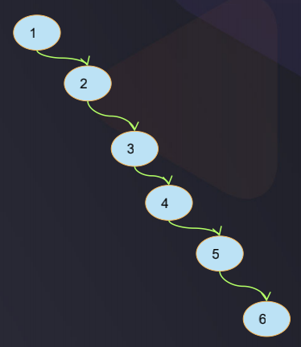
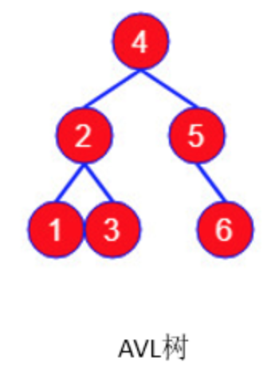
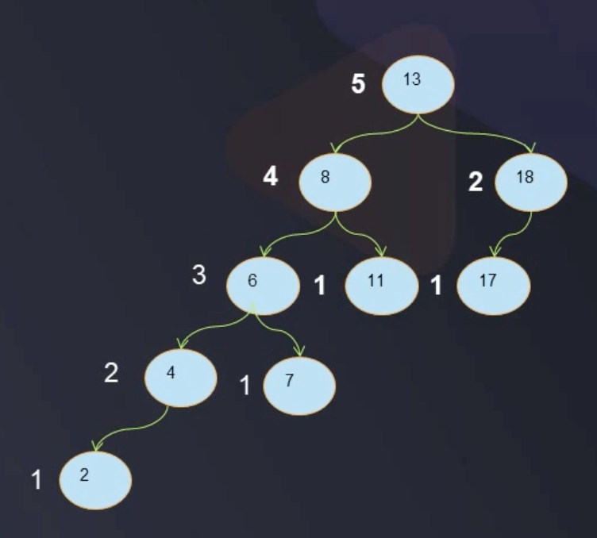

# 平衡二叉树AVL

> From [Doc](https://www.geeksforgeeks.org/avl-tree-set-1-insertion/) AVL tree is a self-balancing Binary Search Tree (BST) where the difference between heights of left and right subtrees cannot be more than one for all nodes. 
> [Doc](https://www.geeksforgeeks.org/avl-tree-set-1-insertion/) Most of the BST operations (e.g., search, max, min, insert, delete.. etc) take O(h) time where h is the height of the BST. The cost of these operations may become O(n) for a skewed Binary tree. If we make sure that height of the tree remains O(Logn) after every insertion and deletion, then we can guarantee an upper bound of O(Logn) for all these operations. The height of an AVL tree is always O(Logn) where n is the number of nodes in the tree

平衡二叉树又被称为AVL树, AVL的名字取字发明者: G. M. Adelson-Velsky 和 E. M. Landis，他们在1962年的论文《An algorithm for the organization of information》中发表了它, 

二叉搜索树BST的设计主要用于提高检索速度, 但是在比较极端的情况下, BST的检索效率很受影响, 比如:  

- 使用数据(1,2,3,4,5,6)创建一棵BST
- 左子树全部为空, 从形式上看, 更像一个单链表, 据此序列构造的二叉搜索树为右斜树，同时二叉树退化成单链表，搜索效率降低为 O(n)
- 插入速度没有影响
- 本来二叉搜索树的设计目的是快递查找, 查询步骤最多为树的深度, 但此时树的深度为节点个数, 可以通过某种方式使用深度减少, 从而优化查询速度
- 解决方案: 重新组织二叉搜索树, 减少树的深度, 变成平衡二叉树 AVL

以上图为例, 在此二叉搜索树中查找元素 6 需要查找 6 次, 二叉搜索树的查找效率取决于树的高度，因此保持树的高度最小，即可保证树的查找效率。同样的序列, 我们把它改为:

查找元素 6 时只需比较 3 次，查找效率提升一倍, 可以看出当节点数目一定，保持树的左右两端保持平衡，以达到树的高度最小, 这样树的查找效率最高。  
这种左右子树的高度相差不超过 1 的树为平衡二叉树。

### 平衡二叉树
平衡二叉树 Self-balancing binary search tree 是二叉搜索树的一种形态, 在了解平衡二叉树的特性之前先来看一些概念.
1. 树的高度
    - 即树的层数

比如上图, 树的层次为5, 即树的高度为5  
另外, 树的高度也可以表示为根节点的高度, 根节点13的高度 = main(节点8的高度, 节点18的高度) + 1 = 5

2. 节点的高度
    - 任意一节点的高度值 = max(左子树高, 右子树高) + 1

3. 节点的平衡因子
    - 节点的左子树的高和右子树的高之差的绝对值叫做平衡因子, 即 abs(leftChildTree.height - rightChildTree.height)

以上图为例, 计算出每个节点的平衡因子

平衡二叉树的特性:
1. 满足二叉搜索树BST的特征
2. 左右子树的高度差最多为1, 也可以说是对于任意一个节点, 平衡因子值不超过1

对于上图, 8和13的平衡因子为2, 因此它不是平衡二叉树, 如果要它平衡, 就涉及到左旋转和右旋转