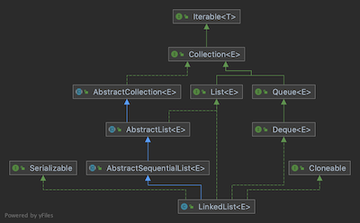

# 二叉搜索树_广度优先遍历

- 广度优先遍历即常说的层次遍历
- 常用于算法设计中, 用作求最短路径
- 一般层次遍历借助队列来实现


比如对于上面图示的树, 算法思路:
队列为: `tail   ...     head`, 元素从队尾进, 队首出
- 7入队列 
```
7
```
- 然后将7出队 --> `7`
- 7出队后, 将其左右子节点3和10分别入队
```
10 3
```
- 3出队 --> `7 3`
- 3出队后, 1和5入队
```
5 1 10
```
- 10出队 --> `7 3 10`
- 10出队后, 9和12入队
```
12 9 5 1
```
- 1, 5, 9, 12分别出队 --> `7 3 10 1 5 9 12`

代码实现: 
借助JDK提供的队列LinkedList实现, LinkedList实现了Queue接口



```java
public void levelOrder(Node node) {
    if (node == null) {
        return;
    }
    // 使用JDK的队列LinkedList(LinkedList实现了Deque接口)
    Queue<Node> queue = new LinkedList<>();
    queue.add(root);
    while (!queue.isEmpty()) {
        Node curNode = queue.remove();
        System.out.println(curNode.e);
        if (curNode.left != null) {
            queue.add(curNode.left);
        }
        if (curNode.right != null) {
            queue.add(curNode.right);
        }
    }
}
```