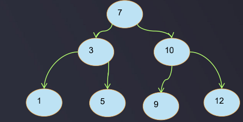

# 二叉搜索树 BST Binary search tree

- 二叉搜索树也叫做二叉排序树，任何一个非叶子节点，要求左子节点的值比当前节点的值小，右子节点的值比当前节点的值大
- 如果有相同的值，可以将该节点放在左子节点或右子节点
- 设计二叉搜索树的主要目的是为了提高检索效率
- 在二叉搜索树中寻找某一个节点最多寻找步骤数为树的深度
- 数据 (7,3,10,12,5,1,9) ，对应的二叉搜索树为:  



对应上图, 假如要插入一个值为2的结点, 则:
- 从根结点开始找, 发现比根结点7要小, 于是:
- 往7的左子结点找, 找到了3, 发现比3还要小, 于是:
- 继续找3的左子结点, 找到了1, 由于2>1, 于是把这个2作为1的右子结点插入

### 自定义一个二叉搜索树  
示例:  
```java
package com.daliu.tree;

/**
 * 自定义二叉搜索树
 * 二叉搜索树也叫做二叉排序树, 任何一个非叶子节点, 要求左子节点的值比当前节点的值小, 右子节点的值比当前节点的值大
 * 由于二叉搜索树的结点有对比操作, 即结点间是可比较的, 因此实现Comparable接口
 * (7,3,10,5,1,9,12)
 */
public class BST <E extends Comparable<E>> {
    // 二分搜索树的节点
    private class Node {
        E e;
        Node left;
        Node right;

        public Node(E e) {
            this.e = e;
            this.left = null;
            this.right = null;
        }
    }

    private Node root;
    private int size; // 节点总个数
    public int size() {
        return size;
    }

    public void addElement(E e) {
        root = addElement(root, e);
    }

    /**
     * 将元素E添加到以node为父节点的树上, 并返回这个父节点, 如果node为null, 则返回这个节点本身
     * @param node 要将元素添加到的父节点
     * @param e 元素
     * @return 新插入节点后的子树的根
     *
     * 注: 此方法暂未考虑值相同的情况, 值相同的情况忽略
     */
    public Node addElement(Node node, E e) {
        if (node == null) { // 递归的结束条件是递归到了叶子节点的下一个元素
            size++;
            return new Node(e);
        }
        if (e.compareTo(node.e) < 0) {
            node.left = addElement(node.left, e); // 递归调用
        } else if (e.compareTo(node.e) > 0) {
            node.right = addElement(node.right, e); // 递归调用
        }
        return node;
    }

    public static void main(String[] args) {
        BST bst = new BST<>();
        bst.addElement(7);
        bst.addElement(3);
        bst.addElement(10);
        bst.addElement(5);
        bst.addElement(1);
        bst.addElement(9);
        bst.addElement(12);
    }
}
```

### 二叉搜索树的查找操作

下面提供二叉搜索树的查找操作, search(E e)查找某一个元素所在节点, searchParent(E e)查找某一个元素的父节点

```java
package com.daliu.tree;

/**
 * 自定义二叉搜索树
 * 二叉搜索树也叫做二叉排序树, 任何一个非叶子节点, 要求左子节点的值比当前节点的值小, 右子节点的值比当前节点的值大
 * 由于二叉搜索树的结点有对比操作, 即结点间是可比较的, 因此实现Comparable接口
 * (7,3,10,5,1,9,12)
 */
public class BST <E extends Comparable<E>> {
    // 二分搜索树的节点
    private class Node {
        E e;
        Node left;
        Node right;

        public Node(E e) {
            this.e = e;
            this.left = null;
            this.right = null;
        }

        @Override
        public String toString() {
            return "Node{" +
                    "e=" + e +
                    ", left=" + left +
                    ", right=" + right +
                    '}';
        }
    }

    private Node root;
    private int size; // 节点总个数
    public int size() {
        return size;
    }

    public void addElement(E e) {
        root = addElement(root, e);
    }

    /**
     * 将元素E添加到以node为父节点的树上, 并返回这个父节点, 如果node为null, 则返回这个节点本身
     * @param node 要将元素添加到的父节点
     * @param e 元素
     * @return 新插入节点后的子树的根
     *
     * 注: 此方法暂未考虑值相同的情况, 值相同的情况忽略
     */
    public Node addElement(Node node, E e) {
        if (node == null) { // 递归的结束条件是递归到了叶子节点的下一个元素
            size++;
            return new Node(e);
        }
        if (e.compareTo(node.e) < 0) {
            node.left = addElement(node.left, e); // 递归调用
        } else if (e.compareTo(node.e) > 0) {
            node.right = addElement(node.right, e); // 递归调用
        }
        return node;
    }

    /**
     * 查找元素所在节点
     * @param e 元素
     * @return 元素所在节点
     */
    public Node search(E e) {
        return search(root, e);
    }

    /**
     * 在以node为根节点的树上查找元素e所在的节点
     * @param node 根节点
     * @param e 要查找的元素
     * @return e 所在的节点
     */
    private Node search(Node node, E e) {
        if (node == null) {
            return null;
        }
        if (e.compareTo(node.e) == 0) {
            return node;
        } else if (e.compareTo(node.e) < 0) { // 去左子树查找
            return search(node.left, e);
        } else { // 去右子树查找
            return search(node.right, e);
        }
    }

    /**
     * 查找指定元素的父节点
     * @param e 元素
     * @return 元素e的父节点
     */
    public Node searchParent(E e) {
        return searchParent(root, e);
    }

    /**
     * 以node为起始根节点查找元素e所在节点的父节点
     * @param node 起始根节点
     * @param e 元素
     * @return 元素e的父节点
     */
    public Node searchParent(Node node, E e) {
        if (node == null) {
            return null;
        }
        if ((node.left != null && e.compareTo(node.left.e) == 0) || (node.right != null && e.compareTo(node.right.e) == 0)) {
            return node;
        }
        if (e.compareTo(node.e) < 0){
            return searchParent(node.left, e);
        } else if (e.compareTo(node.e) > 0) {
            return searchParent(node.right, e);
        } else {
            return null; // 因为add添加元素时没有考虑元素相等的情况,因此这里可以直接返回null
        }
    }

    // 测试代码
    public static void main(String[] args) {
        BST bst = new BST<>();
        bst.addElement(7);
        bst.addElement(3);
        bst.addElement(10);
        bst.addElement(5);
        bst.addElement(1);
        bst.addElement(9);
        bst.addElement(12);
        System.out.println(bst.size()); // 7
        System.out.println(bst.search(3));       // Node{e=3, left=Node{e=1, left=null, right=null}, right=Node{e=5, left=null, right=null}}
        System.out.println(bst.searchParent(5)); // Node{e=3, left=Node{e=1, left=null, right=null}, right=Node{e=5, left=null, right=null}}
    }
}
```

