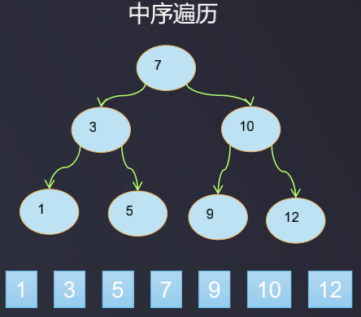
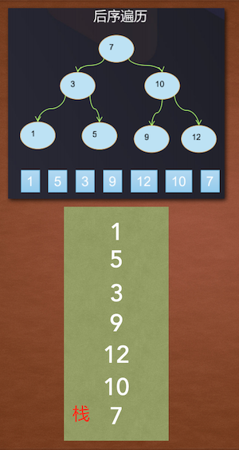

二叉搜索树_深度优先遍历

二叉搜索树的深度优先遍历  
- 二叉树的深度遍历分为：前序遍历、中序遍历、后序遍历
- 前序遍历: 父 -> 左 -> 右, 先输出父节点，再遍历左子树和右子树
- 中序遍历: 左 -> 父 -> 右, 先遍历左子树，再输出父节点，再遍历右子树，中序遍历的结果是有序的
- 后序遍历: 左 -> 右 -> 父, 先遍历左子树，再遍历右子树，最后输出父节点

可以看到, 这里的前,中,后的意思是以父节点所在的位置为参考的, 父节点在前即是前序遍历, 父节点在中和后分别是中序遍历和后序遍历


### 深度优先遍历的递归实现

```java
/**
 * 自定义二叉搜索树
 * 二叉搜索树也叫做二叉排序树, 任何一个非叶子节点, 要求左子节点的值比当前节点的值小, 右子节点的值比当前节点的值大
 * 由于二叉搜索树的结点有对比操作, 即结点间是可比较的, 因此实现Comparable接口
 * (7,3,10,5,1,9,12)
 */
public class BST <E extends Comparable<E>> {
    ...

    /**
     * 前序遍历, 父 > 左 > 右
     */
    public void preOrder() {
        preOrder(root);
    }

    /**
     * 前序遍历的递归实现
     * @param node 根
     */
    private void preOrder(Node node) {
        if (node == null) {
            return;
        }
        System.out.println(node.e);
        preOrder(node.left);
        preOrder(node.right);
    }

    /**
     * 中序遍历, 左 > 父 > 右
     */
    public void midOrder() {
        midOrder(root);
    }

    /**
     * 中序遍历的递归实现
     * @param node 根
     */
    private void midOrder(Node node) {
        if (node == null) {
            return;
        }
        midOrder(node.left);
        System.out.println(node.e);
        midOrder(node.right);
    }

    /**
     * 后序遍历, 左 > 右 > 父
     */
    public void suffixOrder() {
        postOrder(root);
    }

    /**
     * 后序遍历的递归实现
     * @param node 根
     */
    private void postOrder(Node node) {
        if (node == null) {
            return;
        }
        postOrder(node.left);
        postOrder(node.right);
        System.out.println(node.e);
    }

    // 测试代码
    public static void main(String[] args) {
        BST bst = new BST<>();
        bst.addElement(7);
        bst.addElement(3);
        bst.addElement(10);
        bst.addElement(5);
        bst.addElement(1);
        bst.addElement(9);
        bst.addElement(12);
        //System.out.println(bst.size()); // 7
        //bst.preOrder();  // 7 3 1 5 10 9 12
        //bst.midOrder();  // 1 3 5 7 9 10 12
        bst.suffixOrder(); // 1 3 5 9 10 12 7
    }
}
```

--------------------------------------------------------------------------------------

### 深度优先遍历的非递归实现

### 非递归前序遍历

先来看一下非递归实现前序遍历的思路, 借助栈实现, 比如:  


- 前序遍历 父 > 左 > 右
- 首先根节点7入栈, 然后7出栈 --> `7`
- 根出栈时把它的右子节点10和左子节点3依次压栈, 之所以先压10再压3, 是因为栈是后进先出结构, 后进的3应比10早先出栈
```
| 3  |
| 10 |
```
- 栈顶的3出栈 --> `7 3`
```
| 10 |
```
- 3出栈时把它的右和左子节点5和1入栈
```
| 1  |
| 5  |
| 10 |
```
- 5和1都是叶子节点, 因此今次栈顶出栈 --> `7 3 1 5`, 于是只剩下10:
```
| 10 |
```
- 继续栈顶出栈, 即10出栈 --> `7 3 1 5 10`, 10出栈时把它的右和左子节点10和9依次入栈:
```
| 9  |
| 12 |
```
- 继续栈顶出栈 --> `7 3 1 5 10 9 12`

代码实现:

```java
/**
 * 非递归方式前序遍历
 */
public void preOrder() {
    if (root == null) {
        return;
    }
    Stack<Node> stack = new Stack<>();
    stack.push(root);
    while (!stack.isEmpty()) {
        Node curNode = stack.pop();
        System.out.println(curNode.e);
        // 出栈的同时把它的右孩子和左孩子入栈
        if (curNode.right != null) {
            stack.push(curNode.right);
        }
        if (curNode.left != null) {
            stack.push(curNode.left);
        }
    }
}
```

### 非递归中序遍历

非递归算法的中序遍历也是借助栈实现, 思路: 
```java
循环体内:

if (当前节点存在) {
    当前节点入栈
    当前节点 = 当前节点的左子节点
} else {
    出栈
    一旦出栈, 当前节点 = 当前节点的右子节点
}

即核心是: 入栈时, curNode=curNode.leftChild, 出栈时, curNode=curNode.rightChild
```

示例:  



- 当前节点curNode=7, 不为空, 7入栈, 7入栈后, curNode=7.leftChild=3
- 3入栈, 入栈后curNode=3.leftChild=1
- 1入栈
```
| 1 |
| 3 |
| 7 |
```
- 入栈后curNode=1.leftChild=null, 由于curNode=null, 栈顶元素1出栈 --> `1`
```
| 3 |
| 7 |
```
- 1出栈后把当前节点变为它的右子节点, 即 curNode=1.leftChild=null
- 由于curNode=null, 则继续3出栈 --> `1 3`
```
| 7 |
```
- 3出栈后把curNode=3.rightChild=5, 5入栈
```
| 5 |
| 7 |
```

- 5入栈后, curNode=5.leftChild=null, 5出栈 --> `1 3 5`
```
| 7 |
```
- 5出栈后curNode=5.leftChild=null, 7出栈 --> `1 3 5 7`
```
|空栈|
```

- 7出栈后, curNode=7.rightChild=10, 10入栈

```
| 10 |
```
- 10入栈后curNode=10.leftChild=9, 入栈
```
| 9  |
| 10 |
```
- 9入栈后curNode=9.leftChild=null, 9出栈: --> `1 3 5 7 9`
```
| 10 |
```

- 9出栈后curNode=9.rightChild=null, 10出栈 --> `1 3 5 7 9 10`
```
|空栈|
```

- 10出栈后curNode=10.rightChild=12, 12入栈
```
| 12 |
```
- 12入栈后curNode=12.leftChild=null, 12出栈 --> `1 3 5 7 9 10 12`
```
|空栈|
```
- 12出栈后curNode=12.rightChild=null, 打算继续出栈, 但此时栈为空(curNode也为空), 结束

代码:

```java
/**
 * 非递归方式中序遍历
 */
public void midOrder() {
    if (root == null) {
        return;
    }
    Stack<Node> stack = new Stack<>();
    Node curNode = root;
    while (curNode != null || !stack.isEmpty()) {
        if (curNode != null) {
            stack.push(curNode); // 左子不为空, 左子入栈
            curNode = curNode.left;
        } else {
            curNode = stack.pop(); // 左子为空, 栈顶出栈
            System.out.println(curNode.e);
            curNode = curNode.right;
        }
    }
}
```

### 非递归后序遍历



非递归后序遍历稍微有些复杂, 因为当所有的左子树上的节点全部展示后, 再展示所有的右子树, 最后展示头节点, 对应到栈结构入栈的顺序是反过来的: 父节点入栈 > 右子树所有节点入栈 > 左子树所有节点入栈, 这里有个特点是假如同层的右节点入栈后, 不能马上入栈同层的左节点, 要等右节点所有的子节点全入栈后, 同层的左节点才能入栈, 比如对于同层的3和10来说, 当10入栈后, 3不能马上继续入栈, 而要等到10的子节点12和9全部入栈后, 节点3才可以入栈; 为了达到这种效果, 可以设置两个栈, 让"3"这个节点先放在栈A里呆一会, 等10的所有子节点都已入栈B后, 再把栈A中的3压入栈B中

代码实现:

```java
/**
 * 非递归后序遍历
 */
public void postOrder(Node node) {
    if (root == null) {
        return;
    }
    Stack<Node> stackA = new Stack<>();
    Stack<Node> stackB = new Stack<>();
    Node curNode = node;
    stackA.push(curNode);
    while (!stackA.isEmpty()) {
        curNode = stackA.pop();
        stackB.push(curNode);
        if (curNode.left != null) {
            stackA.push(curNode.left);
        }
        if (curNode.right != null) {
            stackA.push(curNode.right);
        }
    }
    while (!stackB.isEmpty()) {
        System.out.println(stackB.pop().e);
    }
}
```

### 非递归遍历的全部代码清单:

```java
package com.daliu.tree;

import java.util.Stack;

/**
 * 自定义二叉搜索树
 * 二叉搜索树也叫做二叉排序树, 任何一个非叶子节点, 要求左子节点的值比当前节点的值小, 右子节点的值比当前节点的值大
 * 由于二叉搜索树的结点有对比操作, 即结点间是可比较的, 因此实现Comparable接口
 * (7,3,10,5,1,9,12)
 */
public class BST <E extends Comparable<E>> {
    // 二分搜索树的节点
    private class Node {
        E e;
        Node left;
        Node right;

        public Node(E e) {
            this.e = e;
            this.left = null;
            this.right = null;
        }

        @Override
        public String toString() {
            return "Node{" +
                    "e=" + e +
                    ", left=" + left +
                    ", right=" + right +
                    '}';
        }
    }

    private Node root;
    private int size; // 节点总个数
    public int size() {
        return size;
    }

    public void addElement(E e) {
        root = addElement(root, e);
    }

    /**
     * 将元素E添加到以node为父节点的树上, 并返回这个父节点, 如果node为null, 则返回这个节点本身
     * @param node 要将元素添加到的父节点
     * @param e 元素
     * @return 新插入节点后的子树的根
     *
     * 注: 此方法暂未考虑值相同的情况, 值相同的情况忽略
     */
    public Node addElement(Node node, E e) {
        if (node == null) { // 递归的结束条件是递归到了叶子节点的下一个元素
            size++;
            return new Node(e);
        }
        if (e.compareTo(node.e) < 0) {
            node.left = addElement(node.left, e); // 递归调用
        } else if (e.compareTo(node.e) > 0) {
            node.right = addElement(node.right, e); // 递归调用
        }
        return node;
    }

    /**
     * 查找元素所在节点
     * @param e 元素
     * @return 元素所在节点
     */
    public Node search(E e) {
        return search(root, e);
    }

    /**
     * 在以node为根节点的树上查找元素e所在的节点
     * @param node 根节点
     * @param e 要查找的元素
     * @return e 所在的节点
     */
    private Node search(Node node, E e) {
        if (node == null) {
            return null;
        }
        if (e.compareTo(node.e) == 0) {
            return node;
        } else if (e.compareTo(node.e) < 0) { // 去左子树查找
            return search(node.left, e);
        } else { // 去右子树查找
            return search(node.right, e);
        }
    }

    /**
     * 查找指定元素的父节点
     * @param e 元素
     * @return 元素e的父节点
     */
    public Node searchParent(E e) {
        return searchParent(root, e);
    }

    /**
     * 以node为起始根节点查找元素e所在节点的父节点
     * @param node 起始根节点
     * @param e 元素
     * @return 元素e的父节点
     */
    public Node searchParent(Node node, E e) {
        if (node == null) {
            return null;
        }
        if ((node.left != null && e.compareTo(node.left.e) == 0) || (node.right != null && e.compareTo(node.right.e) == 0)) {
            return node;
        }
        if (e.compareTo(node.e) < 0){
            return searchParent(node.left, e);
        } else if (e.compareTo(node.e) > 0) {
            return searchParent(node.right, e);
        } else {
            return null; // 因为add添加元素时没有考虑元素相等的情况,因此这里可以直接返回null
        }
    }

    public void preOrder() {
        preOrder(root);
    }

    /**
     * 非递归方式前序遍历
     */
    public void preOrder(Node node) {
        if (node == null) {
            return;
        }
        Stack<Node> stack = new Stack<>();
        stack.push(root);
        while (!stack.isEmpty()) {
            Node curNode = stack.pop();
            System.out.println(curNode.e);
            // 出栈的同时把它的右孩子和左孩子入栈
            if (curNode.right != null) {
                stack.push(curNode.right);
            }
            if (curNode.left != null) {
                stack.push(curNode.left);
            }
        }
    }


    public void midOrder() {
        midOrder(root);
    }

    /**
     * 非递归方式中序遍历
     */
    public void midOrder(Node node) {
        if (node == null) {
            return;
        }
        Stack<Node> stack = new Stack<>();
        Node curNode = root;
        while (curNode != null || !stack.isEmpty()) {
            if (curNode != null) {
                stack.push(curNode); // 左子不为空, 左子入栈
                curNode = curNode.left;
            } else {
                curNode = stack.pop(); // 左子为空, 栈顶出栈
                System.out.println(curNode.e);
                curNode = curNode.right;
            }
        }
    }

    public void postOrder() {
        postOrder(root);
    }

    /**
     * 非递归后序遍历
     */
    public void postOrder(Node node) {
        if (root == null) {
            return;
        }
        Stack<Node> stackA = new Stack<>();
        Stack<Node> stackB = new Stack<>();
        Node curNode = node;
        stackA.push(curNode);
        while (!stackA.isEmpty()) {
            curNode = stackA.pop();
            stackB.push(curNode);
            if (curNode.left != null) {
                stackA.push(curNode.left);
            }
            if (curNode.right != null) {
                stackA.push(curNode.right);
            }
        }
        while (!stackB.isEmpty()) {
            System.out.println(stackB.pop().e);
        }
    }

    // 测试代码
    public static void main(String[] args) {
        BST bst = new BST<>();
        bst.addElement(7);
        bst.addElement(3);
        bst.addElement(10);
        bst.addElement(5);
        bst.addElement(1);
        bst.addElement(9);
        bst.addElement(12);
        System.out.println("前序遍历:");
        bst.preOrder();
        System.out.println("中序遍历:");
        bst.midOrder();
        System.out.println("后序遍历:");
        bst.postOrder();
    }
}
```

参考: 

- [Here](https://blog.csdn.net/qq_46122005/article/details/110895892)