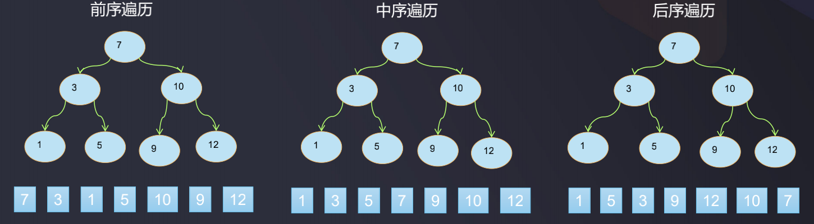

# 二叉搜索树_深度优先遍历

二叉搜索树的深度优先遍历  
- 二叉树的深度遍历分为：前序遍历、中序遍历、后序遍历
- 前序遍历: 父 -> 左 -> 右, 先输出父节点，再遍历左子树和右子树
- 中序遍历: 左 -> 父 -> 右, 先遍历左子树，再输出父节点，再遍历右子树，中序遍历的结果是有序的
- 后序遍历: 左 -> 右 -> 父, 先遍历左子树，再遍历右子树，最后输出父节点

可以看到, 这里的前,中,后的意思是以父节点所在的位置为参考的, 父节点在前即是前序遍历, 父节点在中和后分别是中序遍历和后序遍历



### 深度优先遍历的递归实现

```java
/**
 * 自定义二叉搜索树
 * 二叉搜索树也叫做二叉排序树, 任何一个非叶子节点, 要求左子节点的值比当前节点的值小, 右子节点的值比当前节点的值大
 * 由于二叉搜索树的结点有对比操作, 即结点间是可比较的, 因此实现Comparable接口
 * (7,3,10,5,1,9,12)
 */
public class BST <E extends Comparable<E>> {
    ...

    /**
     * 前序遍历, 父 > 左 > 右
     */
    public void preOrder() {
        preOrder(root);
    }

    /**
     * 前序遍历的递归实现
     * @param node 根
     */
    private void preOrder(Node node) {
        if (node == null) {
            return;
        }
        System.out.println(node.e);
        preOrder(node.left);
        preOrder(node.right);
    }

    /**
     * 中序遍历, 左 > 父 > 右
     */
    public void midOrder() {
        midOrder(root);
    }

    /**
     * 中序遍历的递归实现
     * @param node 根
     */
    private void midOrder(Node node) {
        if (node == null) {
            return;
        }
        midOrder(node.left);
        System.out.println(node.e);
        midOrder(node.right);
    }

    /**
     * 后序遍历, 左 > 右 > 父
     */
    public void suffixOrder() {
        suffixOrder(root);
    }

    /**
     * 后序遍历的递归实现
     * @param node 根
     */
    private void suffixOrder(Node node) {
        if (node == null) {
            return;
        }
        midOrder(node.left);
        midOrder(node.right);
        System.out.println(node.e);
    }

    // 测试代码
    public static void main(String[] args) {
        BST bst = new BST<>();
        bst.addElement(7);
        bst.addElement(3);
        bst.addElement(10);
        bst.addElement(5);
        bst.addElement(1);
        bst.addElement(9);
        bst.addElement(12);
        //System.out.println(bst.size()); // 7
        //bst.preOrder();  // 7 3 1 5 10 9 12
        //bst.midOrder();  // 1 3 5 7 9 10 12
        bst.suffixOrder(); // 1 3 5 9 10 12 7
    }
}
```

### 深度优先遍历的非递归实现

先来看一下非递归实现前序遍历的思路, 借助栈实现, 比如:  


- 前序遍历 父 > 左 > 右
- 首先根节点7入栈, 然后7出栈 --> `7`
- 根出栈时把它的右子节点10和左子节点3依次压栈, 之所以先压10再压3, 是因为栈是后进先出结构, 后进的3应比10早先出栈
```
| 3  |
| 10 |
```
- 栈顶的3出栈 --> `7 3`
```
| 10 |
```
- 3出栈时把它的右和左子节点5和1入栈
```
| 1  |
| 5  |
| 10 |
```
- 5和1都是叶子节点, 因此今次栈顶出栈 --> `7 3 1 5`, 于是只剩下10:
```
| 10 |
```
- 继续栈顶出栈, 即10出栈 --> `7 3 1 5 10`, 10出栈时把它的右和左子节点10和9依次入栈:
```
| 9  |
| 12 |
```
- 继续栈顶出栈 --> `7 3 1 5 10 9 12`