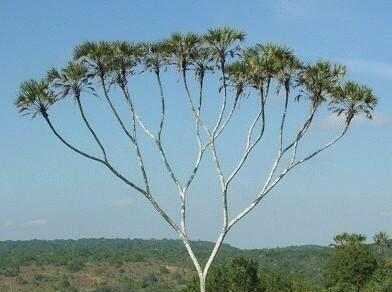
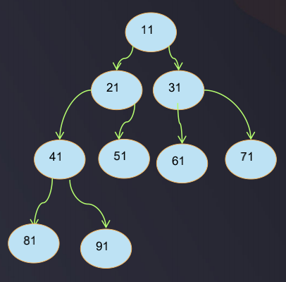
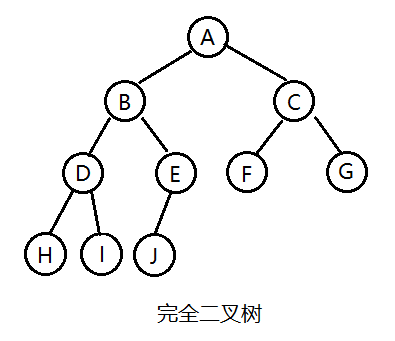
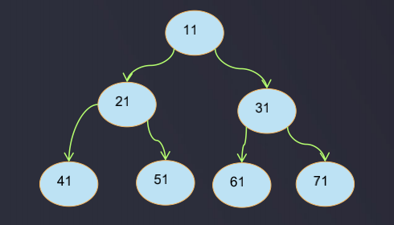
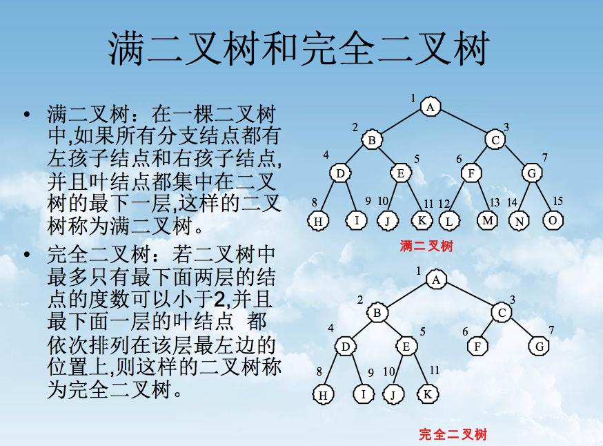
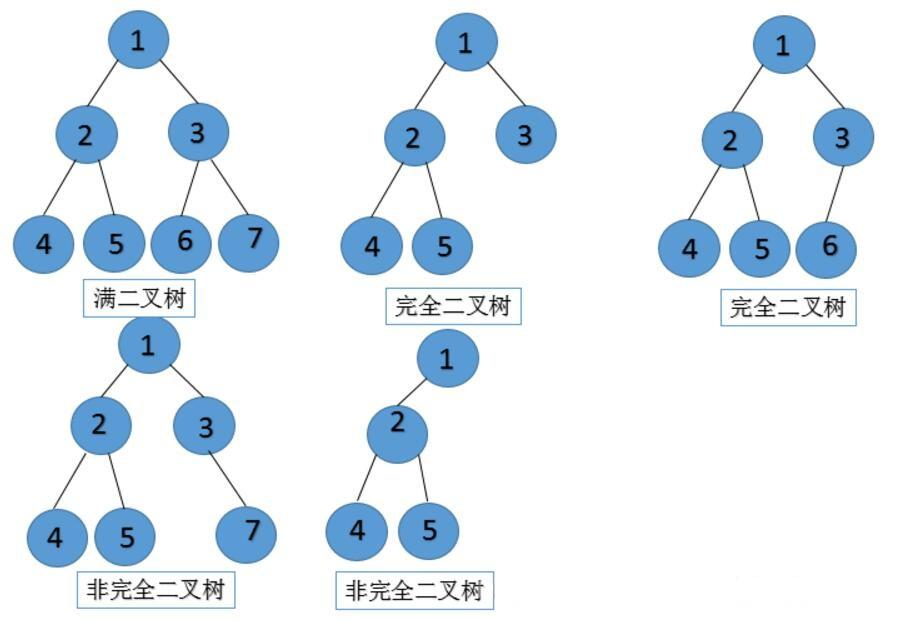

# 二叉树

### 哈哈 -->

### 二叉树的概念

- 每个节点最多只能有两个子节点的树称为二叉树, 即每个节点的度最多为2的树
- 二叉树的子节点分为左节点和右节点

### 完全二叉树

- 完全二叉树: 叶子结点的上一层结点是全满的(即上一层结点数达到了最大值), 每个叶子结点先从后右
- 层数为n的完全二叉树，节点总数=2^n-1
- 如果节点的度是1，则该节点只有左孩子
- 同样节点数目的二叉树，完全二叉树深度最小 u 满二叉树一定是完全二叉树，反之则不一定

### 满二叉树的概念

- 满二叉树是完全二叉树的特殊形态, 
- 一棵深度为k且有2^k-1个结点的二叉树称为满二叉树. (k>=1) 
- 满二叉树肯定是完全二叉树，而完全二叉树不一定是满二叉树
- 所有非叶子节点都存在左子树和右子树，并且所有叶子都在最后一层的二叉树为满二叉树
- 叶子节点只能在最后一层
- 非叶子节点的度一定是2
- 同样深度的二叉树中，满二叉树的节点个数最多，叶子数最多
- 满二叉树每一层的结点个数都达到了最大值, 即满二叉树的第i层上有2^(i-1)个结点 (i≥1)

### 满二叉树和完全二叉树的简易区分

满二叉树是完全二叉树的子集, 为了方便记忆, 可以理解为: 
- 满二叉树是全满的, 同一深度结点总数达到了最大值, 除叶子结点外每一个结点都有2个子结点
- 完全二叉树几乎是全满的, 可以理解为从满二叉树右下子结点往左可以删除若干结点

图示:  

