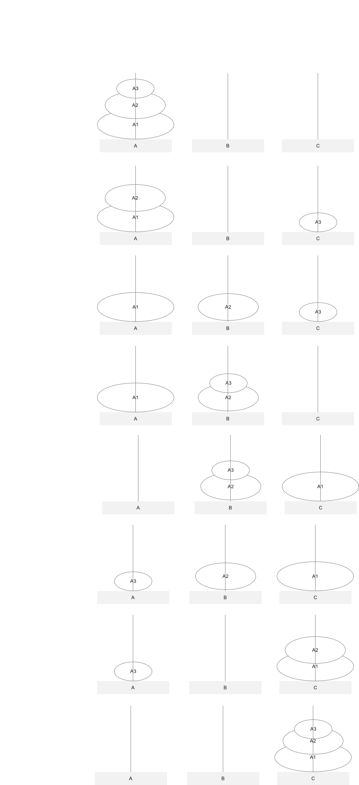

# 汉诺塔

汉诺塔，（又称河内塔）问题是源于印度一个古老传说的益智玩具。大梵天创造世界的时候做了三根金刚石柱子，在一根柱子上从下往上按照大小顺序摞着64片黄金圆盘。大梵天命令婆罗门把圆盘从下面开始按大小顺序重新摆放在另一根柱子上。并且规定，在小圆盘上不能放大圆盘，在三根柱子之间一次只能移动一个圆盘。
这个就是经典的**递归**算法的示例。

我们可以先来三个盘子简单释义，假设柱子为A, B, C，在A柱子上摞着三个盘子（假设盘子中间有个洞，都插在柱子上），从下往上分别是：A1，A2, A3，其中A1 > A2 > A3，我们把这三个盘子借助柱子B，移到柱子C，但要求是：在移动的过程中，大盘子不可以放大小盘子上，由于盘子一共只有3个，我们可以用脑袋完成这个任务：



经过脑袋的分析，移动过程如下：

```
A --> C
A --> B
C --> B
A --> C
B --> A
B --> C
A --> C
```

分析规律，完成N个盘子的移动。
把n个盘子从a，借助b, 移动到c, 定义成函数：hanoi(n, a, b, c)，如果n=1, 那就直接把这1个盘子移到c就可以了，如果n大于1，则把上面n-1个盘子从a移到b, 然后再把剩下的1个盘子从a移到c就好了, 那么把n-1个盘子从a移到c，就先需要先把n-2个盘子从b移到c ... ...

**java版**

```java
public class Hanoi {
	public static void move(int n, char a, char b, char c) {
		if (n == 1) {
			System.out.println(a + " --> " + c);
		}
		else {
			move(n-1, a, c, b);
			System.out.println(a + " --> " + c);
			move(n-1, b, a, c);
		}
	}

	public static void main(String[] args) {
		Hanoi.move(3, 'A', 'B', 'C');
	}
}
```

**python版**

```python
#!/usr/bin/python3

def move(n, a, b, c):
	if n == 1:
		print(a, ' --> ', c)
	else:
		move(n-1, a, c, b)
		print(a, ' --> ', c)
		move(n-1, b, a, c)

move(3, 'A', 'B', 'C')
```


