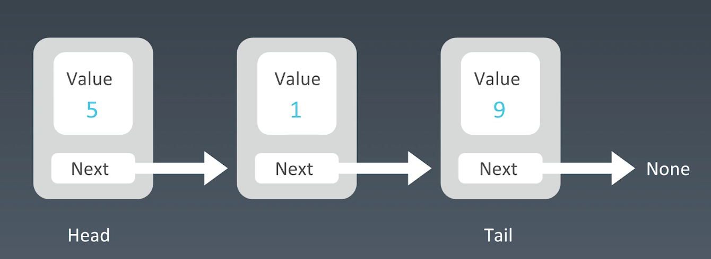

# 链表

链表 (Linked list) 是一种真正动态的数据结构, 是一种物理存储单元上非连续、非顺序的存储结构，数据元素的逻辑顺序是通过链表中的指针链接次序实现的。链表由一系列结点（链表中每一个元素称为结点）组成，结点可以在运行时动态生成。每个结点包括两个部分：一个是存储数据元素的数据域，另一个是存储下一个结点地址的指针域。 相比于线性表顺序结构，操作复杂。由于不必须按顺序存储，链表在插入的时候可以达到O(1)的复杂度，比另一种线性表顺序表快得多，但是查找一个节点或者访问特定编号的节点则需要O(n)的时间，而线性表和顺序表相应的时间复杂度分别是O(logn)和O(1)  

这里的结点通常称为node  

比如如下单链表, 只有一个next指针(或引用)指向后一个结点:  



如果后一个结点都有一个previous指针指向前一个结点, 就叫做双向链表.   
如果tail指针的next指向head, 就叫做循环链表.  

看一下链表的一个数据结构代码:  

```java
class LinkedList {
	Node head; // head of list

	/* Linked list Node*/
	class Node {
		int data;
		Node next;

		// Constructor to create a new node
		// Next is by default initialized
		// as null
		Node(int d) { data = d; }
	}
}
```

- 链表（Linked list）是一种真正的动态的数据结构
- 链表是一种线性表，但是并不会按线性的顺序存储数据，而是在每一个节点里存到下一个节点的指针
- 使用链表结构可以克服数组需要预先知道数据大小的缺点，但增加了结点的指针域，空间开销比较大
- 链表允许插入和移除链表上任意位置上的节点，但是不允许随机存取
- 链表有很多种不同的类型：单向链表，双向链表以及循环链表