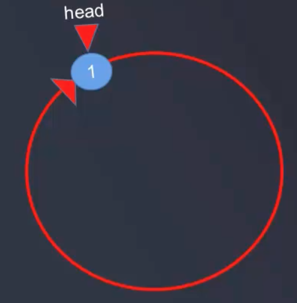
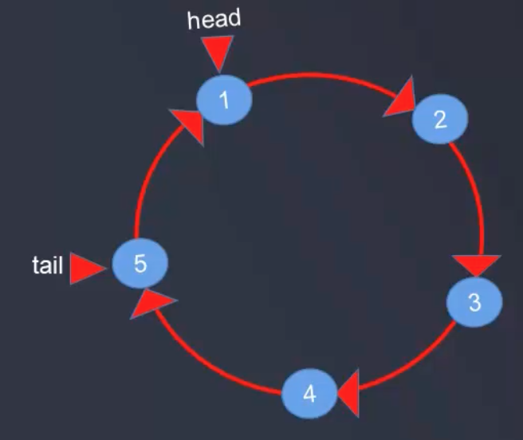

# 环形链表

将单链表最后一个节点指向头节点, 那么这个单链表就是一个环形链表, 比如:  


  

```java
package com.daliu;

// 声明简单的环形链表
public class CircleLinkedList<E> {
    // 定义节点内部类
    private class Node<E> {
        public E e;
        private Node next;
        private Node(E e, Node next) {
            this.e = e;
            this.next = next;
        }
        public Node(E e) {
            this(e, null);
        }
        public Node() {
            this(null);
        }

        @Override
        public String toString() {
            return e.toString();
        }
    }

    // 头节点和尾节点
    private Node head = null;
    private Node tail = null;

    public CircleLinkedList(int nums) {
        if (nums < 1) {
            throw new RuntimeException("nums < 1");
        }
        for (int i = 0; i < nums; i++) {
            Node node = new Node(i);
            if (i == 0) {
                head = node;
                head.next = head;
                tail = head;
            } else {
                tail.next = node;
                node.next = head;
                tail = node;
            }
        }
    }

    public CircleLinkedList() {
        this(5);
    }
}
```