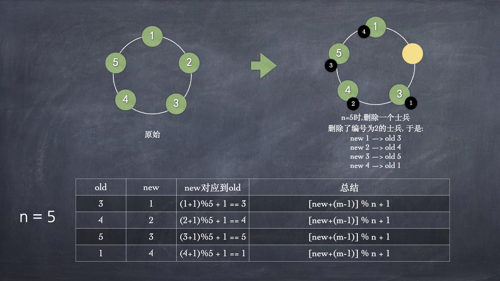
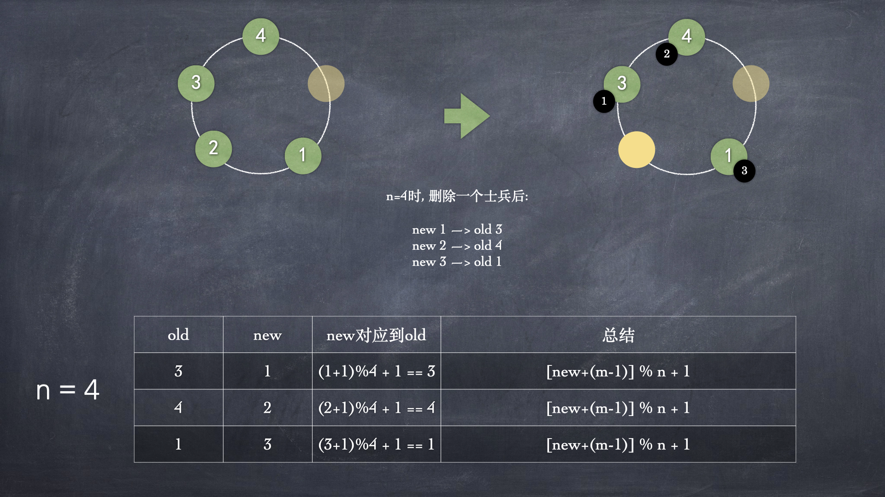
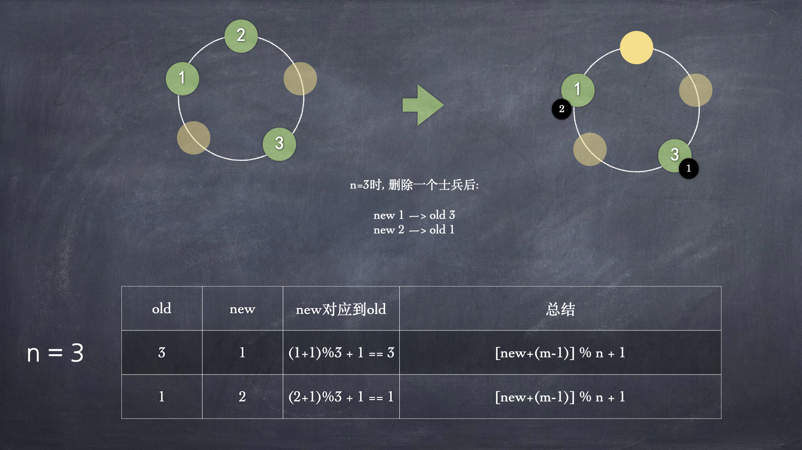
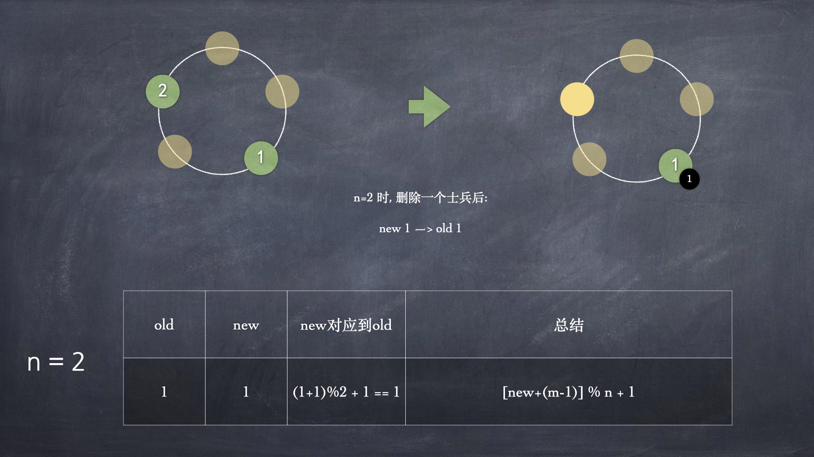

# 环形链表之约瑟夫问题

据说著名犹太历史学家Josephus有过以下的故事：在罗马人占领乔塔帕特后，39 个犹太人与Josephus及他的朋友躲到一个洞中，39个犹太人决定宁愿死也不要被敌人抓到，于是决定了一个自杀方式，41个人排成一个圆圈，由第1个人开始报数，每报数到第3人该人就必须自杀，然后再由下一个重新报数，直到所有人都自杀身亡为止。然而Josephus 和他的朋友并不想遵从, 于是Josephus想出一个主意改变了原来的规则: 首先从一个人开始，越过k-2个人（因为第一个人已经被越过），并杀掉第k个人。接着，再越过k-1个人，并杀掉第k个人。这个过程沿着圆圈一直进行，直到最终只剩下一个人留下，这个人就可以继续活着。问题是，给定了和，一开始要站在什么地方才能避免被处决。Josephus要他的朋友先假装遵从，他将朋友与自己安排在第16个与第31个位置，于是逃过了这场死亡游戏   

再来看一个问题:  
17世纪的法国数学家加斯帕在《数目的游戏问题》中讲了这样一个故事：15个教徒和15 个非教徒在深海上遇险，必须将一半的人投入海中，其余的人才能幸免于难，于是想了一个办法：30个人围成一圆圈，从第一个人开始依次报数，每数到第九个人就将他扔入大海，如此循环进行直到仅余15个人为止。问怎样排法，才能使每次投入大海的都是非教徒  

再看来一个猴子选大王的问题:  
- 一堆猴子都有编号, 编号是: 1, 2, 3, ...n, 这n个猴子按照 1~n 的顺序围坐一圈 
- 从第k个开始数, 每数到第m个, 该猴子就要离开此圈
- 下一次从k+1个开始, 直到圈中只剩下最后一只猴子, 则该猴子为大王
- 2 > 4 > 1 > 5 > 3 (3号为大王)

以上问题都是典型的环形链表问题  

为了简便起见, 先来看一下猴子选大王的示例, 从第k个开始数, 每数到第m个, 该猴子就要离开此圈, 假设 k=1, m=2, 一共有5个猴子, 分析:  

首先 head 指向1, tail指向5
  

从1开始数, 数2个, 则head指向了2, tail紧随着head, tail指向了1:  
  

由于head所指向的2要被删除, 于是head就不能再指向2了, 于是head前移指向了3

  

这时候要把head所指向的2删掉:  
  
    

再继续从3开始数, 数2个, 于是head指向4, tail指向3
    

这时候要把head所指向的4删掉, 于是head前移指向5, 同时删除4:
   
   

再继续从5开始数2位, 数到了1, 于是head指向1, tail指向5:
    

这时候要把head所指向的1删掉, 于是head前移指向3, 同时删除1: 
    

再继续从3开始数2位, 数到了5, 于是head指向5, tail指向3:
  

这时候要把head所指向的5删掉, 于是head指向3, tail也指向3, 同时删除5:  
  

于是, 3号猴子就是大王

代码实现:  

```java
package com.daliu;

public class CircleLinkedList<E> {
    // 定义节点内部类
    private class Node<E> {
        public E e;
        private Node next;
        private Node(E e, Node next) {
            this.e = e;
            this.next = next;
        }
        public Node(E e) {
            this(e, null);
        }
        public Node() {
            this(null);
        }

        @Override
        public String toString() {
            return e.toString();
        }
    }

    // 头节点和尾节点
    private Node head = null;
    private Node tail = null;

    public CircleLinkedList(int nums) {
        if (nums < 1) {
            throw new RuntimeException("nums < 1");
        }
        // 为了对应猴子选大王中的序号, 这里从1开始
        for (int i = 1; i <= nums; i++) {
            Node node = new Node(i);
            if (i == 1) {
                head = node;
                head.next = head;
                tail = head;
            } else {
                tail.next = node;
                node.next = head;
                tail = node;
            }
        }
    }

    public CircleLinkedList() {
        this(5);
    }

    /**
     * 出圈
     * @param startNo 从第几个开始数
     * @param countNum 一次数几下
     * @param nums 最开始的节点数
     */
    public void exitCircle(int startNo, int countNum, int nums) {
        // 数据校验
        if (head == null || startNo < 1 || startNo > nums) {
            throw new RuntimeException("参数非法");
        }
        // 把head和tail挪动到相应的位置
        for (int i = 0; i < startNo-1; i++) {
            head = head.next;
            tail = tail.next;
        }
        while (true) {
            if (tail == head) {
                break;
            }
            for (int i = 0; i < countNum - 1; i++) {
                // head和tail前移countNum步
                head = head.next;
                tail = tail.next;
            }
            // 前移完成后, head可以出圈了
            System.out.println(head.e + " 出圈");
            head = head.next;
            tail.next = head;
        }
        System.out.println("大王: " + head.e); // 此时同tail.e, head和tail指向同一个节点
    }

    // 测试
    public static void main(String[] args) {
        CircleLinkedList<Integer> circleLinkedList = new CircleLinkedList<>();
        circleLinkedList.exitCircle(1, 2, 5);
    }
}
```

程序打印: 
```
2 出圈
4 出圈
1 出圈
5 出圈
大王: 3
```

### 约瑟夫问题的递归解法

问题描述：编号为 1-N 的 N 个士兵围坐在一起形成一个圆圈，从编号为 1 的士兵开始依次报数（1，2，3...这样依次报），数到 m 的 士兵出列，之后的士兵再从 1 开始报数。直到最后剩下一士兵，求这个士兵的编号 

看到[这里](https://zhuanlan.zhihu.com/p/74436158)有一个说明, 我们解释一下递归做法的理论:  

递归思路是每一次删除士兵之后，对这些士兵从被删除士兵之后的士兵开始重新从1开始编号，难点就是找出删除前和删除后士兵编号的映射关系(因为求的以最原始编号为准)   

为了简化问题并方便说明, 我这里把问题规模暂定为5, 即类似于上面的猴子选大王, 这里假定有5个士兵, 编号为1, 2, 3 4, 5, 从1开始数, 每数到2时删除一个士兵, 图示:  







```java
package com.daliu;

public class Recursive {
    public static int f(int n, int m){
        return n == 1 ? n : (f(n - 1, m) + m - 1) % n + 1; // 核心代码
    }

    public static void main(String[] args) {
        System.out.println(f(5, 2)); // 3
    }
}
```