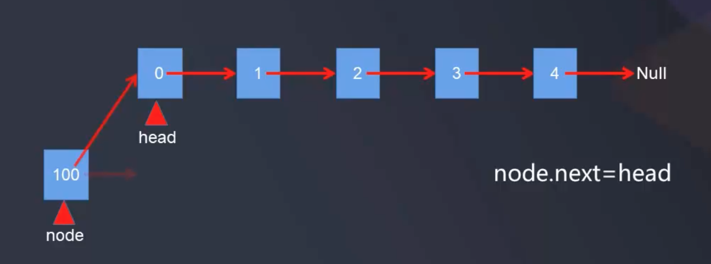
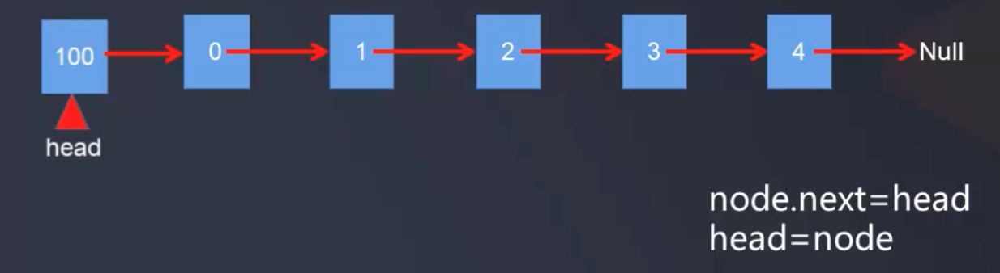
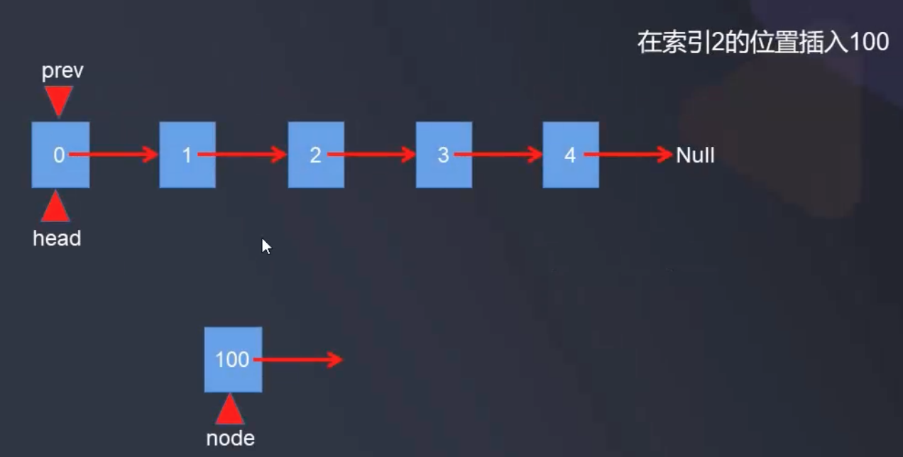
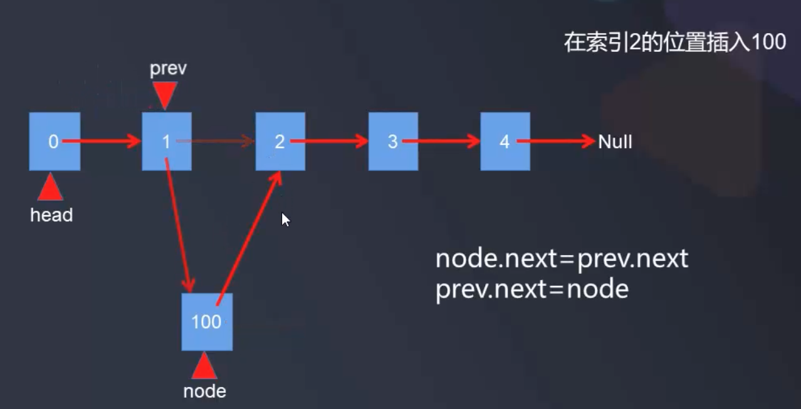
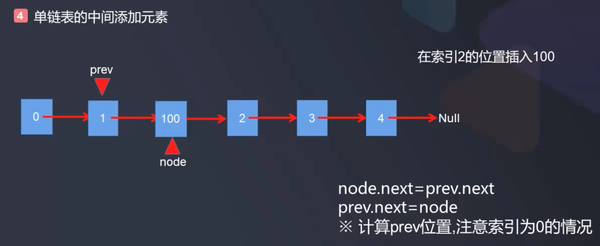

# 自定义单链表_添加操作


单链表的定义:

- 链表中的数据是以结点Node来表示的
- 每个结点的构成：元素 + 指针
- 元素就是存储数据的存储单元，指针就是连接每个结点的地址数据
- 以“结点的序列”表示线性表称作线性链表（单链表），单链表是链式存取的结构

单链表从头部插入一个结点:  


```java
// 单链表从头部插入一个结点
public void addFirst(E e) {
    Node node = new Node(e);
    node.next = head.next;
    head = node;
    size++;
}
```

单链表在指定位置插入一个结点, 比如在索引为2的位置插入一个新的结点100: 





注意当pre为0时, 其实就是在头结点插入结点

```java
// 单链表在指定索引位置index处插入一个结点
public void add(int index, E e) {
    // 找到index的前一个结点pre
    if (index < 0 || index > size) {
        throw new RuntimeException("add failed, index illegal");
    }
    if (index == 0) {
        // 等于0即在链表头部插入结果
        addFirst(e);
    } else {
        Node prev = head;
        for (int i = 0; i < index-1; i++) {
            prev = prev.next;
        }

        Node node = new Node(e);
        node.next = prev.next;
        prev.next = node;
        size++;
    }
}
```

完整自定义单链表, 实现添加操作的代码:

```java
package com.daliu;

public class SingleLinkedList<E> {
    //头结点指针
    private Node head;
    // 结点个数
    private int size;

    public SingleLinkedList() {
        head = null;
        size = 0;
    }

    public int getSize() {
        return size;
    }

    public boolean isEmpty() {
        return size == 0;
    }

    // 单链表从头部插入一个结点
    public void addFirst(E e) {
        Node node = new Node(e);
        node.next = head.next;
        head = node;
        size++;
    }

    // 单链表在指定索引位置index处插入一个结点
    public void add(int index, E e) {
        // 找到index的前一个结点pre
        if (index < 0 || index > size) {
            throw new RuntimeException("add failed, index illegal");
        }
        if (index == 0) {
            // 等于0即在链表头部插入结果
            // 由于index为0时没有prev, 所以特殊处理
            addFirst(e);
        } else {
            Node prev = head;
            for (int i = 0; i < index-1; i++) {
                prev = prev.next;
            }

            Node node = new Node(e);
            node.next = prev.next;
            prev.next = node;
            // 上面三句代码也可简化为一句:
            // prev.next = new Node(e, prev.next);

            size++;
        }
    }

    public void addLast(E e) {
        add(size, e);
    }

    // 定义结点内部类
    private class Node {
        public E e;
        private Node next;
        private Node(E e, Node next) {
            this.e = e;
            this.next = next;
        }
        public Node(E e) {
            this(e, null);
        }
        public Node() {
            this(null);
        }

        @Override
        public String toString() {
            return e.toString();
        }
    }
}
```

