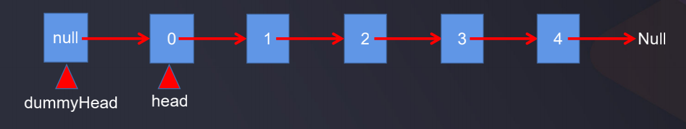

# 自定义单链表_虚拟头结点

上一节中自定义实现单链表对index=0时作了特殊处理:
```java
// 单链表在指定索引位置index处插入一个结点
public void add(int index, E e) {
    ...
    if (index == 0) {
        // 等于0即在链表头部插入结果
        // 由于index为0时没有prev, 所以特殊处理
        addFirst(e);
    }
    ...
```

对于index=0时, 除了上述处理方式外, 还可以通过增加虚拟头结点进行优化处理: 

  

有了虚拟头结点dummyHead, 再做新增插入操作的时候, 即使index=0时, 再找它的前面的一个结点依然可以找得到, 一般在操作单链表时都给它加一个虚拟头结点. 这有点类似于循环队列中单独拿出来一个空间来判断这个队列是不是满队列  

有了虚拟头结点dummyHead后, 指向index为0的head指针可以不再需要了.  

改造上一节实现单链表的方式, 增加一个虚拟头结点:

```java
package com.daliu;

public class SingleLinkedList<E> {
    // 定义结点内部类
    private class Node {
        public E e;
        private Node next;
        private Node(E e, Node next) {
            this.e = e;
            this.next = next;
        }
        public Node(E e) {
            this(e, null);
        }
        public Node() {
            this(null);
        }

        @Override
        public String toString() {
            return e.toString();
        }
    }

    //头结点指针
    private Node dummyHead;
    // 结点个数
    private int size;

    public SingleLinkedList() {
        dummyHead = new Node(null, null);
        size = 0;
    }

    public int getSize() {
        return size;
    }

    public boolean isEmpty() {
        return size == 0;
    }

    // 单链表从头部插入一个结点
    public void addFirst(E e) {
        Node node = new Node(e);
        add(0, e);
    }

    // 单链表在指定索引位置index处插入一个结点
    public void add(int index, E e) {
        // 找到index的前一个结点pre
        if (index < 0 || index > size) {
            throw new RuntimeException("add failed, index illegal");
        }
        Node prev = dummyHead;
        for (int i = 0; i < index; i++) {
            prev = prev.next;
        }
        prev.next = new Node(e, prev.next);

        size++;
    }

    public void addLast(E e) {
        add(size, e);
    }

    @Override
    public String toString() {
        StringBuilder builder = new StringBuilder();
        Node cur = dummyHead.next;
        while (cur != null) {
            builder.append(cur + "->");
            cur = cur.next;
        }
        builder.append("NULL");
        return builder.toString();
    }
}
```

测试代码:

```java
package com.daliu;

public class Main {
    public static void main(String[] args) {
        SingleLinkedList<Object> linkedList = new SingleLinkedList<>();
        for (int i = 0; i < 5; i++) {
            linkedList.addFirst(i);
            System.out.println(linkedList);
        }
    }
}
```

程序打印:

```
0->NULL
1->0->NULL
2->1->0->NULL
3->2->1->0->NULL
4->3->2->1->0->NULL
```
