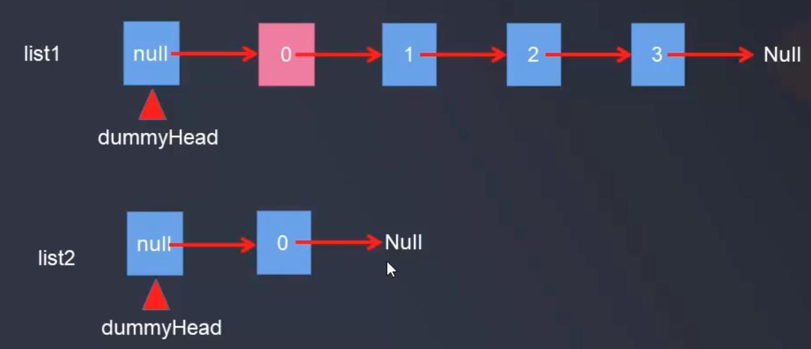

# 反转链表

[https://leetcode-cn.com/problems/reverse-linked-list/?utm_source=LCUS&utm_medium=ip_redirect_q_uns&utm_campaign=transfer2china](https://leetcode-cn.com/problems/reverse-linked-list/?utm_source=LCUS&utm_medium=ip_redirect_q_uns&utm_campaign=transfer2china)

反转一个单链表

示例:  
```
输入: 1->2->3->4->5->NULL
输出: 5->4->3->2->1->NULL
```

你可以迭代或递归地反转链表。你能否用两种方法解决这道题?  

### 方法一: 迭代  

参考 [力扣](https://leetcode-cn.com/problems/reverse-linked-list/solution/fan-zhuan-lian-biao-by-leetcode/)

在遍历列表时，将当前节点的 next 指针改为指向前一个元素。由于节点没有引用其上一个节点，因此必须事先存储其前一个元素。在更改引用之前，还需要另一个指针来存储下一个节点。不要忘记在最后返回新的头引用

```java
// Definition for singly-linked list
class ListNode {
	int val;
	ListNode next = null;
	ListNode(int x) {
		val = x;
	}
}

public class Solution {
	// Reverse算法
	// 力扣运行表现:
	// 执行时间很有优势, 但内存消耗比较大, 在所有 Java 提交中只击败了5.06%的用户
	// 时间复杂度：O(n)，假设 n 是列表的长度，时间复杂度是 O(n)
	// 空间复杂度：O(1)
	public ListNode reverseList(ListNode head) {
        ListNode pre = null;
        ListNode cur = head;
        while (cur != null) {
            ListNode nextTemp = cur.next;
            cur.next = pre;
            pre = cur;
            cur = nextTemp;
        }
        return pre;
    }
	
	public ListNode makeLinkNode() {
		ListNode one = new ListNode(1);
		ListNode two = new ListNode(2);
		ListNode three = new ListNode(3);
		ListNode four = new ListNode(4);
		ListNode five = new ListNode(5);
		one.next = two;
		two.next = three;
		three.next = four;
		four.next = five;
		return one;
	}
	
	public static void printListNode(ListNode head) {
		ListNode current = head;
		while (current != null) {
			System.out.println(current.val);
			current = current.next;
		}
	}
	
	public static void main(String[] args) {
		Solution solution = new Solution();
		ListNode head = solution.makeLinkNode();
		System.out.println("反转之前:");
		printListNode(head);
		ListNode reversed = solution.reverseList(head);
		System.out.println("反转之后:");
		printListNode(reversed);
	}
}
```

### 方法二: 递归  
递归版本稍微复杂一些，其关键在于反向工作。假设列表的其余部分已经被反转，现在我该如何反转它前面的部分？

```java
public ListNode reverseList(ListNode head) {
    if (head == null || head.next == null) return head;
    ListNode p = reverseList(head.next);
    head.next.next = head;
    head.next = null;
    return p;
}
```

复杂度分析:  

时间复杂度：O(n)，假设 nn 是列表的长度，那么时间复杂度为 O(n)。  
空间复杂度：O(n)，由于使用递归，将会使用隐式栈空间。递归深度可能会达到 n 层。

递归算法有点绕:  

不妨假设链表为1，2，3，4，5。按照递归，当执行reverseList（5）的时候返回了5这个节点，reverseList(4)中的p就是5这个节点，我们看看reverseList（4）接下来执行完之后，5->next = 4, 4->next = null。这时候返回了p这个节点，也就是链表5->4->null，接下来执行reverseList（3），代码解析为4->next = 3,3->next = null，这个时候p就变成了，5->4->3->null, reverseList(2), reverseList(1)依次类推，p就是:5->4->3->2->1->null

### 方法三: 遍历原链表, 引入新链表, 循环在表头插入



如图所示引入一个新的辅助链表, 不断的遍历原来的链表, 不断的在新的链表结构的表头插入, 下面在自定义的链表中加上一个revert方法, 作为返转链表方法:
```java
package com.daliu;

public class SingleLinkedList<E> {
    // 定义结点内部类
    private class Node {
        public E e;
        private Node next;
        private Node(E e, Node next) {
            this.e = e;
            this.next = next;
        }
        public Node(E e) {
            this(e, null);
        }
        public Node() {
            this(null);
        }

        @Override
        public String toString() {
            return e.toString();
        }
    }

    //头结点指针
    private Node dummyHead;
    // 实际结点个数
    private int size;

    public SingleLinkedList() {
        dummyHead = new Node(null, null);
        size = 0;
    }

    public int getSize() {
        return size;
    }

    public boolean isEmpty() {
        return size == 0;
    }

    // 单链表从头部插入一个结点
    public void addFirst(E e) {
        Node node = new Node(e);
        add(0, e);
    }

    // 单链表在指定索引位置index处插入一个结点
    public void add(int index, E e) {
        // 找到index的前一个结点pre
        if (index < 0 || index > size) {
            throw new RuntimeException("add failed, index illegal");
        }
        Node prev = dummyHead;
        for (int i = 0; i < index; i++) {
            prev = prev.next;
        }
        prev.next = new Node(e, prev.next);

        size++;
    }

    public void addLast(E e) {
        add(size, e);
    }

    // 获得链表的第index(0-based)个位置的元素
    public E get(int index) {
        if (index < 0 || index > size) {
            throw new RuntimeException("get failed, Illegal index");
        }
        Node current = dummyHead.next;
        for (int i = 0; i < index; i++) {
            current = current.next; // 循环结束后current指向index索引对应的结点
        }
        return current.e;
    }

    public E getFirst() {
        return get(0);
    }

    public E getLast() {
        return get(size-1);
    }

    public void set(int index, E e) {
        if (index < 0 || index > size) {
            throw new RuntimeException("set failed, Illegal index");
        }
        Node current = dummyHead.next;
        for (int i = 0; i < index; i++) {
            current = current.next; // 循环结束后current指向index索引对应的结点
        }
        current.e = e;
    }

    // 查看指定元素是否存在
    public boolean contains(E e) {
        Node current = dummyHead.next;
        while (current != null) {
            if (current.e.equals(e)) {
                return true;
            }
            current = current.next;
        }
        return false;
    }

    // 从链表中删除index位置的元素, 返回删除的元素
    public E remove(int index) {
        if (index < 0 || index > size) {
            throw new RuntimeException("remove fail, index is illegal");
        }
        Node prev = dummyHead; // 要删除结点的前一个结点
        for (int i = 0; i < index; i++) {
            prev = prev.next;
        }

        Node retNode = prev.next;
        prev.next = retNode.next;
        retNode.next = null;
        size--;
        return retNode.e;
    }

    public E removeFirst() {
        return remove(0);
    }

    public E removeLast() {
        return remove(size - 1);
    }

    // 给定元素, 删除对应结点
    public void removeElement(E e) {
        Node prev = dummyHead; // prev 指向要删除结点的前一个结点
        while (prev.next != null) {
            if (prev.next.e.equals(e)) {
                break;
            }
            prev = prev.next;
        }
        if (prev.next != null) {
            Node delNode = prev.next;
            prev.next = delNode.next;
            delNode = null;
            size--;
        }
    }

    // 翻转链表
    public void revert() {
        Node current = dummyHead.next;
        Node next = current.next;
        Node reversedHead = new Node();
        while (current != null) {
            next = current.next;

            current.next = reversedHead.next;
            reversedHead.next = current;

            current = next;
        }
        dummyHead = reversedHead;
    }

    @Override
    public String toString() {
        StringBuilder builder = new StringBuilder();
        Node cur = dummyHead.next;
        while (cur != null) {
            builder.append(cur + "->");
            cur = cur.next;
        }
        builder.append("NULL");
        return builder.toString();
    }

    public static void main(String[] args) {
        SingleLinkedList<Object> linkedList = new SingleLinkedList<>();
        for (int i = 0; i < 5; i++) {
            linkedList.addFirst(i);
            System.out.println(linkedList);
        }
        linkedList.add(1, 100);
        System.out.println(linkedList);
        linkedList.revert();
        System.out.println(linkedList);
    }
}
```

程序打印:

```java
0->NULL
1->0->NULL
2->1->0->NULL
3->2->1->0->NULL
4->3->2->1->0->NULL
4->100->3->2->1->0->NULL
0->1->2->3->100->4->NULL
```
