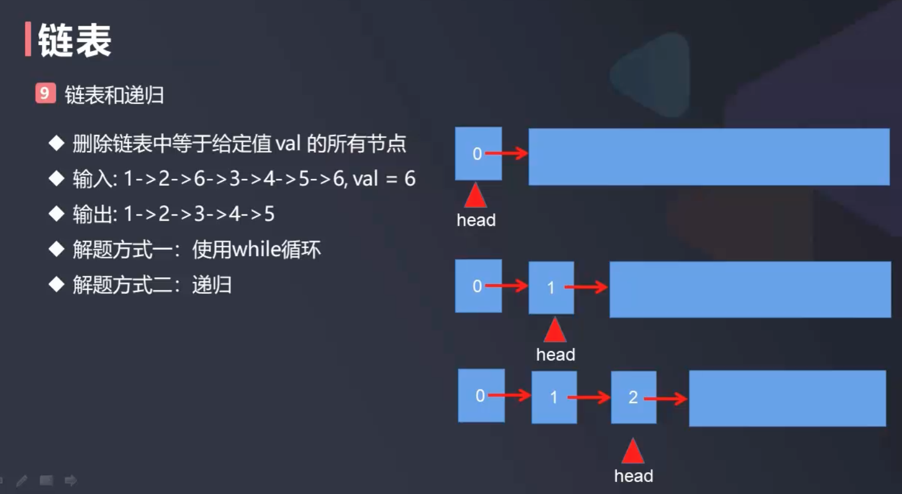

# 递归性_元素删除

  

给你一个链表的头节点 head 和一个整数 val ，请你删除链表中所有满足 Node.val == val 的节点，并返回 新的头节点  

思路一: 循环遍历删除  

```java
class ListNode {
    int val;
    ListNode next;
    ListNode() {}
    ListNode(int val) { this.val = val; }
    ListNode(int val, ListNode next) { this.val = val; this.next = next; }

    public ListNode(int[] arr) {
        if (arr == null || arr.length == 0) {
            throw new RuntimeException("array can not be empty");
        }
        this.val = arr[0];
        ListNode cur = this;
        for (int i = 1; i < arr.length; i++) {
            cur.next = new ListNode(arr[i]);
            cur = cur.next;
        }
    }

    @Override
    public String toString() {
        StringBuilder builder = new StringBuilder();
        ListNode cur = this;
        while (cur != null) {
            builder.append(cur.val + "->");
            cur = cur.next;
        }
        builder.append("NULL");
        return builder.toString();
    }
}

public class Solution {
    //https://leetcode-cn.com/problems/remove-linked-list-elements/
    public ListNode removeElements(ListNode head, int val) {
        // 思路一：循环遍历删除
        // 如果头节点正好是要删除的节点，则删除过虑掉
        while (head != null && head.val == val) {
            ListNode delNode = head; // delNode指向要删除的head
            head = head.next; // head指针后移
            delNode.next = null; // 代表delNode从链中断开，即删除
        }
        if (head == null) {
            return head; // 删除头节点后发现为空，说明现在整个链表是空的
        }
        // 待删除的节点是中间节点
        ListNode prev = head; // 找到前一个节点
        while (prev.next != null) {
            if (prev.next.val == val) { // prev.next是当前节目光炯炯
                ListNode delNode = prev.next;
                prev.next = delNode.next;
                delNode.next = null;
            } else {
                prev = prev.next;
            }
        }
        return head;
    }

    public static void main(String[] args) {
        int[] nums = {1,2,6,3,4,5,6};
        int val = 6;
        ListNode head = new ListNode(nums);
        ListNode listNode = new Solution().removeElements(head, val);
        System.out.println(listNode); // 1->2->3->4->5->NULL
    }
}
```

思路二: 使用递归  



```java
package com.daliu.leetcode;

class ListNode {
    int val;
    ListNode next;
    ListNode() {}
    ListNode(int val) { this.val = val; }
    ListNode(int val, ListNode next) { this.val = val; this.next = next; }

    public ListNode(int[] arr) {
        if (arr == null || arr.length == 0) {
            throw new RuntimeException("array can not be empty");
        }
        this.val = arr[0];
        ListNode cur = this;
        for (int i = 1; i < arr.length; i++) {
            cur.next = new ListNode(arr[i]);
            cur = cur.next;
        }
    }

    @Override
    public String toString() {
        StringBuilder builder = new StringBuilder();
        ListNode cur = this;
        while (cur != null) {
            builder.append(cur.val + "->");
            cur = cur.next;
        }
        builder.append("NULL");
        return builder.toString();
    }
}

public class Solution {
    //https://leetcode-cn.com/problems/remove-linked-list-elements/
    public ListNode removeElements(ListNode head, int val) {
        // 思路二：递归
        if (head == null) {
            return head;
        }
        ListNode listNode = removeElements(head.next, val);
        if (head.val == val) {
            return listNode;
        } else {
            head.next = listNode;
            return head;
        }
    }

    public static void main(String[] args) {
        int[] nums = {1,2,6,3,4,5,6};
        int val = 6;
        ListNode head = new ListNode(nums);
        ListNode listNode = new Solution().removeElements(head, val);
        System.out.println(listNode); // 1->2->3->4->5->NULL
    }
}
```