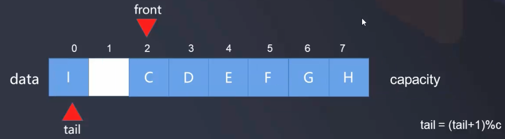

# 循环队列

- 我们采用面向接口编程的方式, 队列可以在底层有多种实现方式, 和Array对比, 队列的操作就是数组中相应操作的一个约束操作.  
- 前面章节中在使用数组完成简单的队列时, 对于这种队列的出队操作, 时间复杂度为O(n), 因为每当出队一个元素, 后面的元素都要相应的往前移动. 
- 如果有一个队首指针和队尾指针标记起始和结束, 则对于出队操作时间复杂度可优化到O(1), 这就是循环队列   

- front: 指向队首
- tail: 指向队尾(队列中最后一个元素的下一个索引位置)
- size: 代表队列中元素的个数
- capacity: 代表队列总容量个数-1(预留一个空间为了不让首尾重合,并判断是否队满)

- 循环队列的底层依然是数组, 只是增加了指向头和尾的指针
- 开始时front和tail都指向第一个元素, 此时队列状态为空状态, 每次在队尾入队一个元素, tail后移
- 注: 规定当front = tail时队列为空队列

每次在队首出队一个元素, front后移

当tail移到最后时, 由于是循环队列, 如果队首有空间, 则tail就可以移到 tail=(tail+1)%c 的位置, c是capacity, 即数组的容量

当继续移动到tail马上可以赶上front时队列为满: 

