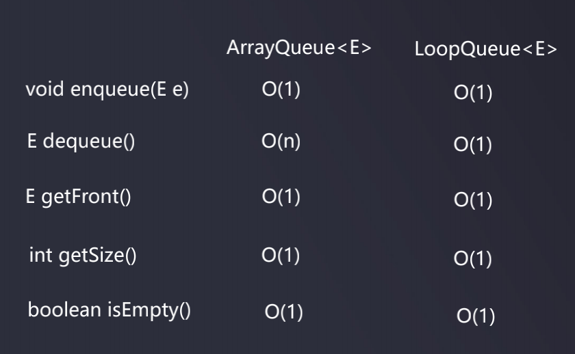

# 队列的时间复杂度



测试代码:

```java
package com.daliu;

import java.util.Random;

public class Main {
    public static void main(String[] args) {
        int opNum = 100000;
        // 分别执行10万次的ArrayQueue和LoopQueue的出入队操作
        // 对比耗费时间
        ArrayQueue<Integer> arrayQueue = new ArrayQueue<>();
        LoopQueue<Integer> loopQueue = new LoopQueue<>();
        double time1 = testQueue(arrayQueue, opNum);
        double time2 = testQueue(loopQueue, opNum);
        System.out.println("ArrayQueue: " + time1);
        System.out.println("LoopQueue: " + time2);
    }

    private static double testQueue(Queue<Integer> queue, int opNum) {
        long startTime = System.currentTimeMillis(); // 微秒 //System.nanoTime(); // 纳秒
        Random random = new Random();
        for (int i = 0; i < opNum; i++) {
            queue.enqueue(random.nextInt(Integer.MAX_VALUE));
        }
        for (int i = 0; i < opNum; i++) {
            queue.dequeue();
        }
        long endTime = System.currentTimeMillis();
        return (endTime - startTime) / 1000.0;

        // 1秒=1000毫秒(ms) 1毫秒=1／1,000秒(s)
        // 1秒=1,000,000 微秒(μs) 1微秒=1／1,000,000秒(s)
        // 1秒=1,000,000,000 纳秒(ns) 1纳秒=1／1,000,000,000秒(s)
        // 1秒=1,000,000,000,000 皮秒(ps) 1皮秒=1／1,000,000,000,000秒(s)
    }
}
```

程序打印结果:  
ArrayQueue: 3.559  
LoopQueue: 0.016

可见, 出入队列频繁的话, LoopQueue的优势就体现出来了  


